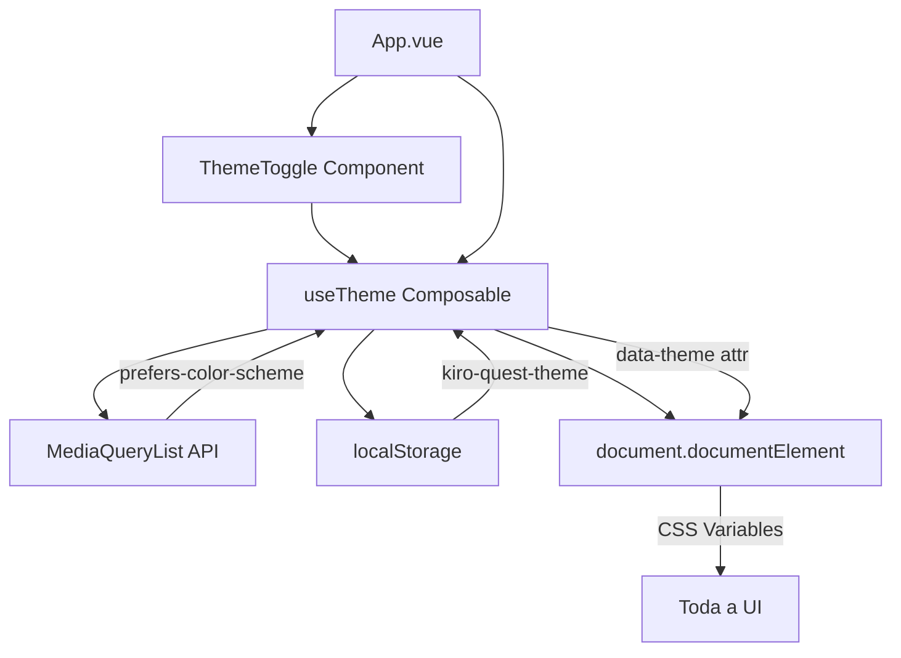
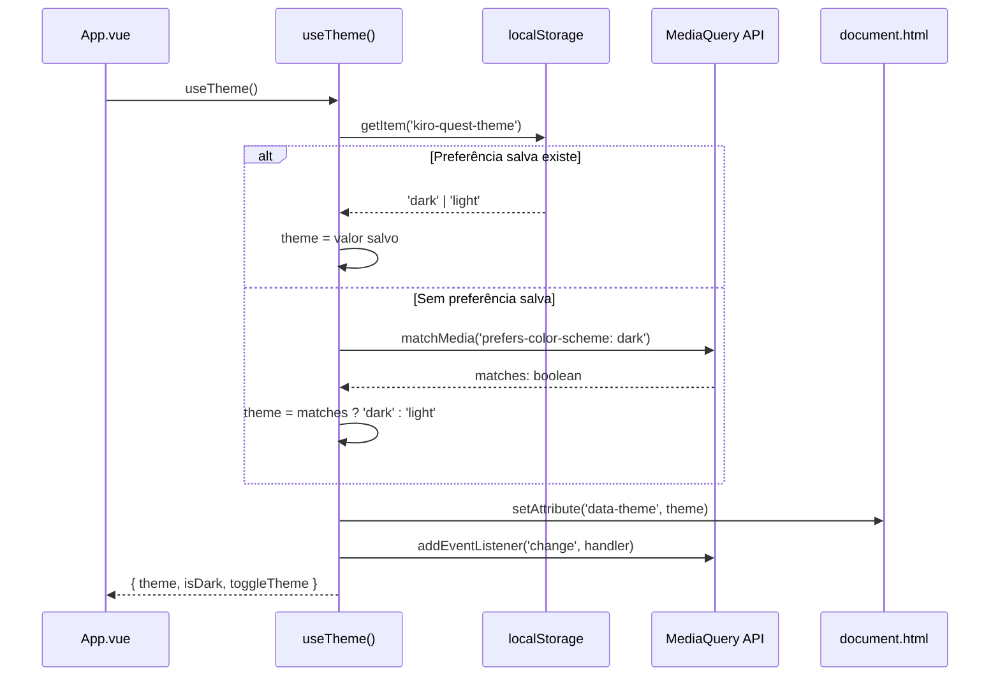
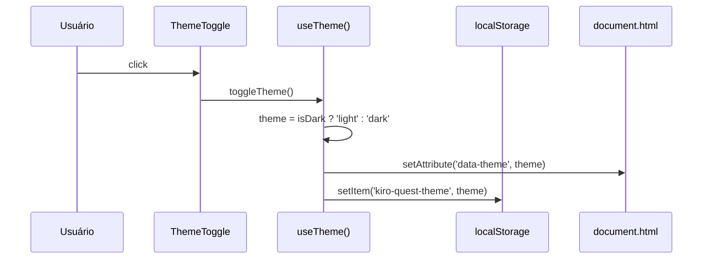

# Design Document: Dark Mode

## Overview

O recurso de Dark Mode adiciona suporte a tema escuro na aplicação Kiro Quest, permitindo que os usuários alternem entre os modos claro e escuro. O sistema detecta automaticamente a preferência do sistema operacional do usuário (`prefers-color-scheme`) como padrão inicial, e oferece um botão de alternância acessível e sempre visível na interface para troca manual de tema. A preferência do usuário é persistida no `localStorage` para manter a escolha entre sessões.

A implementação aproveita a arquitetura existente de CSS variables em `variables.css`, adicionando um conjunto de variáveis para o tema escuro que são ativadas via atributo `data-theme="dark"` no elemento `<html>`. Um composable Vue (`useTheme`) encapsula toda a lógica reativa de detecção, alternância e persistência do tema.

## Architecture



### Diagrama de Sequência: Inicialização do Tema



### Diagrama de Sequência: Alternância Manual



## Components and Interfaces

### Componente: ThemeToggle

**Propósito**: Botão flutuante acessível que permite ao usuário alternar entre tema claro e escuro.

**Interface**:
```typescript
// Nenhuma prop necessária — usa o composable useTheme internamente
// Emite nenhum evento — efeito colateral via composable
```

**Responsabilidades**:
- Renderizar ícone de sol (modo escuro ativo → clique muda para claro) ou lua (modo claro ativo → clique muda para escuro)
- Fornecer `aria-label` descritivo para leitores de tela
- Posicionar-se de forma fixa e acessível na tela
- Respeitar `min-touch-target` de 44px

### Composable: useTheme

**Propósito**: Encapsular toda a lógica de gerenciamento de tema (detecção, alternância, persistência, sincronização com DOM).

**Interface**:
```typescript
type Theme = 'light' | 'dark'

interface UseThemeReturn {
  theme: Readonly<Ref<Theme>>
  isDark: ComputedRef<boolean>
  toggleTheme: () => void
}

function useTheme(): UseThemeReturn
```

**Responsabilidades**:
- Detectar preferência do sistema via `window.matchMedia('(prefers-color-scheme: dark)')`
- Carregar preferência salva do `localStorage` (chave: `kiro-quest-theme`)
- Aplicar tema no DOM via `document.documentElement.setAttribute('data-theme', theme)`
- Escutar mudanças na preferência do sistema (quando não há preferência salva)
- Persistir escolha manual no `localStorage`
- Prover estado reativo para componentes consumidores

## Data Models

### Persistência do Tema

```typescript
// Chave no localStorage
const THEME_STORAGE_KEY = 'kiro-quest-theme'

// Valores possíveis
type ThemePreference = 'light' | 'dark'
```

**Regras de Validação**:
- Valor lido do `localStorage` deve ser exatamente `'light'` ou `'dark'`
- Qualquer outro valor é tratado como ausência de preferência (fallback para sistema)
- Se `localStorage` não estiver disponível, usar apenas detecção do sistema

### CSS Variables — Tema Escuro

```typescript
// Estrutura conceitual das variáveis que serão sobrescritas
interface DarkThemeVariables {
  '--color-text': string           // texto claro sobre fundo escuro
  '--color-text-secondary': string
  '--color-text-inverse': string
  '--color-background': string     // fundo escuro principal
  '--color-background-secondary': string
  '--color-background-card': string
  '--color-surface': string
  '--color-border': string
  '--color-border-focus': string
  '--color-primary-light': string  // ajustado para contraste em fundo escuro
  '--color-success-light': string
  '--color-error-light': string
  '--color-warning-light': string
  '--shadow-sm': string
  '--shadow-md': string
  '--shadow-lg': string
}
```

## Pseudocódigo Algorítmico

### Algoritmo: Inicialização do Tema

```typescript
function initializeTheme(): Theme {
  // Passo 1: Verificar preferência salva
  const saved = localStorage.getItem(THEME_STORAGE_KEY)
  
  if (saved === 'light' || saved === 'dark') {
    return saved
  }
  
  // Passo 2: Detectar preferência do sistema
  const prefersDark = window.matchMedia('(prefers-color-scheme: dark)').matches
  
  return prefersDark ? 'dark' : 'light'
}
```

**Pré-condições:**
- `window` e `document` estão disponíveis (ambiente browser)
- `localStorage` pode não estar disponível (modo privado em alguns browsers)

**Pós-condições:**
- Retorna exatamente `'light'` ou `'dark'`
- Não produz efeitos colaterais (apenas leitura)

### Algoritmo: Aplicação do Tema no DOM

```typescript
function applyTheme(theme: Theme): void {
  document.documentElement.setAttribute('data-theme', theme)
}
```

**Pré-condições:**
- `theme` é `'light'` ou `'dark'`
- `document.documentElement` existe

**Pós-condições:**
- `document.documentElement` possui atributo `data-theme` com valor igual a `theme`
- CSS variables do tema correspondente são ativadas via seletor `[data-theme="dark"]`

### Algoritmo: Alternância de Tema

```typescript
function toggleTheme(currentTheme: Ref<Theme>): void {
  const newTheme: Theme = currentTheme.value === 'dark' ? 'light' : 'dark'
  
  currentTheme.value = newTheme
  applyTheme(newTheme)
  persistTheme(newTheme)
}
```

**Pré-condições:**
- `currentTheme` é um `Ref` reativo com valor `'light'` ou `'dark'`

**Pós-condições:**
- `currentTheme.value` é o oposto do valor anterior
- DOM reflete o novo tema
- `localStorage` contém o novo valor

**Invariante:**
- `currentTheme.value` sempre é igual ao atributo `data-theme` no DOM

### Algoritmo: Listener de Mudança do Sistema

```typescript
function handleSystemThemeChange(
  event: MediaQueryListEvent,
  theme: Ref<Theme>,
  hasUserPreference: boolean
): void {
  // Só reage se o usuário não fez escolha manual
  if (hasUserPreference) return
  
  const newTheme: Theme = event.matches ? 'dark' : 'light'
  theme.value = newTheme
  applyTheme(newTheme)
}
```

**Pré-condições:**
- `event` é um `MediaQueryListEvent` válido do listener `prefers-color-scheme`
- `hasUserPreference` indica se existe valor no `localStorage`

**Pós-condições:**
- Se `hasUserPreference` é `true`: nenhuma mudança ocorre
- Se `hasUserPreference` é `false`: tema é atualizado para refletir preferência do sistema

## Funções-Chave com Especificações Formais

### useTheme()

```typescript
export function useTheme(): UseThemeReturn {
  const theme = ref<Theme>(initializeTheme())
  const isDark = computed(() => theme.value === 'dark')
  
  // Aplicar tema inicial no DOM
  applyTheme(theme.value)
  
  // Escutar mudanças do sistema
  const mediaQuery = window.matchMedia('(prefers-color-scheme: dark)')
  const hasUserPreference = localStorage.getItem(THEME_STORAGE_KEY) !== null
  
  const handler = (e: MediaQueryListEvent) => {
    handleSystemThemeChange(e, theme, hasUserPreference)
  }
  mediaQuery.addEventListener('change', handler)
  
  // Cleanup no unmount do componente
  onScopeDispose(() => {
    mediaQuery.removeEventListener('change', handler)
  })
  
  function toggleTheme(): void {
    const newTheme: Theme = theme.value === 'dark' ? 'light' : 'dark'
    theme.value = newTheme
    applyTheme(newTheme)
    localStorage.setItem(THEME_STORAGE_KEY, newTheme)
  }
  
  return {
    theme: readonly(theme),
    isDark,
    toggleTheme,
  }
}
```

**Pré-condições:**
- Executado em contexto de setup de componente Vue ou escopo reativo

**Pós-condições:**
- Tema é aplicado no DOM imediatamente
- Listener de mudança do sistema está registrado
- Retorna interface reativa para consumo por componentes

## Exemplo de Uso

```typescript
// Em App.vue ou qualquer componente
import { useTheme } from '@/composables/useTheme'

const { theme, isDark, toggleTheme } = useTheme()
```

```vue
<!-- ThemeToggle.vue -->
<script setup lang="ts">
import { useTheme } from '@/composables/useTheme'

const { isDark, toggleTheme } = useTheme()
</script>

<template>
  <button
    class="theme-toggle"
    :aria-label="isDark ? 'Mudar para tema claro' : 'Mudar para tema escuro'"
    @click="toggleTheme"
  >
    <span v-if="isDark">☀️</span>
    <span v-else>🌙</span>
  </button>
</template>
```

```css
/* Em variables.css — variáveis do tema escuro */
[data-theme="dark"] {
  --color-text: #e2e8f0;
  --color-text-secondary: #94a3b8;
  --color-text-inverse: #1e293b;
  
  --color-background: #0f172a;
  --color-background-secondary: #1e293b;
  --color-background-card: #1e293b;
  --color-surface: #1e293b;
  
  --color-border: #334155;
  --color-border-focus: #818cf8;
  
  --color-primary-light: #312e81;
  --color-success-light: #064e3b;
  --color-error-light: #7f1d1d;
  --color-warning-light: #78350f;
  
  --color-error-dark: #fca5a5;
  --color-warning-dark: #fbbf24;
  
  --shadow-sm: 0 1px 2px 0 rgb(0 0 0 / 0.3);
  --shadow-md: 0 4px 6px -1px rgb(0 0 0 / 0.4), 0 2px 4px -2px rgb(0 0 0 / 0.3);
  --shadow-lg: 0 10px 15px -3px rgb(0 0 0 / 0.4), 0 4px 6px -4px rgb(0 0 0 / 0.3);
}
```

## Correctness Properties

*Uma propriedade é uma característica ou comportamento que deve ser verdadeiro em todas as execuções válidas de um sistema — essencialmente, uma declaração formal sobre o que o sistema deve fazer. Propriedades servem como ponte entre especificações legíveis por humanos e garantias de correção verificáveis por máquina.*

### Property 1: Consistência DOM-Estado

*Para qualquer* sequência de operações (inicialização, alternância, mudança de sistema), o valor de `theme.value` deve ser idêntico ao atributo `data-theme` no `document.documentElement`. Ou seja: `theme.value === document.documentElement.getAttribute('data-theme')`.

**Validates: Requirements 7.1, 2.3, 7.3**

### Property 2: Persistência Round-Trip

*Para qualquer* tema válido (`'light'` ou `'dark'`), após chamar `toggleTheme()` até atingir esse tema, o valor em `localStorage.getItem('kiro-quest-theme')` deve ser igual a `theme.value`, e reinicializar o composable deve restaurar o mesmo tema.

**Validates: Requirements 2.4, 3.1, 3.2**

### Property 3: Detecção Inicial Determinística

*Para qualquer* combinação de estado de `localStorage` (valor válido, valor inválido, ausente) e `prefers-color-scheme` (dark, light), a função `initializeTheme()` sempre retorna o mesmo resultado dado os mesmos inputs. A função é pura em relação a esses inputs.

**Validates: Requirements 1.1, 1.2**

### Property 4: Fallback Seguro

*Para qualquer* cenário onde `localStorage` lança exceção (ex: modo privado), o sistema deve usar a preferência do sistema operacional sem propagar erro ao usuário e sem interromper a funcionalidade de alternância.

**Validates: Requirements 8.1, 8.3**

### Property 5: Valores Sempre Válidos

*Para qualquer* string arbitrária armazenada no `localStorage` (incluindo strings vazias, números, JSON, caracteres especiais), `initializeTheme()` sempre retorna exatamente `'light'` ou `'dark'` — nunca `null`, `undefined` ou outro valor.

**Validates: Requirements 8.2, 8.4**

### Property 6: Inversão por Toggle

*Para qualquer* tema inicial (`'light'` ou `'dark'`), chamar `toggleTheme()` uma vez produz o tema oposto, e chamar duas vezes retorna ao tema original. Para N toggles, o tema final é previsível: se N é par, tema é o inicial; se N é ímpar, tema é o oposto.

**Validates: Requirements 2.1, 2.2**

### Property 7: Prioridade da Preferência do Usuário

*Para qualquer* Preferência_Salva válida no localStorage e qualquer mudança na Preferência_do_Sistema, o tema ativo deve permanecer igual à Preferência_Salva, ignorando a mudança do sistema.

**Validates: Requirements 4.2**

### Property 8: Aria-label Reflete Ação Oposta

*Para qualquer* estado de tema ativo, o atributo `aria-label` do ThemeToggle deve descrever a ação que resultará do clique (mudar para o tema oposto ao atual), garantindo que o label nunca esteja vazio ou descreva o estado atual em vez da ação.

**Validates: Requirements 6.1, 6.3, 6.4**

## Error Handling

### Cenário 1: localStorage Indisponível

**Condição**: Browser em modo privado ou `localStorage` desabilitado
**Resposta**: Capturar exceção silenciosamente, usar apenas detecção do sistema
**Recuperação**: Funcionalidade de alternância continua funcionando (sem persistência entre sessões)

### Cenário 2: Valor Inválido no localStorage

**Condição**: Valor armazenado não é `'light'` nem `'dark'` (corrupção ou manipulação manual)
**Resposta**: Ignorar valor inválido, tratar como ausência de preferência
**Recuperação**: Usar detecção do sistema como fallback

### Cenário 3: matchMedia Não Suportado

**Condição**: Browser muito antigo sem suporte a `matchMedia`
**Resposta**: Usar `'light'` como tema padrão
**Recuperação**: Botão de alternância continua funcional para troca manual

## Testing Strategy

### Testes Unitários

- `useTheme` retorna tema correto baseado em `localStorage`
- `useTheme` detecta preferência do sistema quando não há valor salvo
- `toggleTheme` alterna corretamente entre `'light'` e `'dark'`
- `toggleTheme` persiste novo valor no `localStorage`
- `applyTheme` define atributo `data-theme` corretamente no DOM
- Valores inválidos no `localStorage` são tratados como ausência

### Testes Property-Based (fast-check)

**Biblioteca**: fast-check (já instalada no projeto)

- **Propriedade de Inversão**: Para qualquer sequência de N toggles, o tema final é previsível (`N % 2 === 0` → tema inicial, `N % 2 === 1` → tema oposto)
- **Propriedade de Idempotência**: Aplicar o mesmo tema duas vezes não muda o estado
- **Propriedade de Valores Válidos**: Para qualquer string arbitrária no `localStorage`, `initializeTheme()` sempre retorna `'light'` ou `'dark'`

### Testes de Integração

- Componente `ThemeToggle` renderiza ícone correto baseado no tema atual
- Clique no `ThemeToggle` altera as CSS variables visíveis
- Mudança na preferência do sistema (simulada) atualiza o tema quando não há preferência manual

## Considerações de Performance

- CSS variables são resolvidas nativamente pelo browser — sem custo de re-render JavaScript
- Transição suave entre temas via `transition` em `background-color` e `color` (usando `--transition-normal` existente)
- Nenhuma dependência externa adicionada
- `matchMedia` listener é leve e nativo

## Considerações de Segurança

- Dados armazenados no `localStorage` são apenas `'light'` ou `'dark'` — sem informação sensível
- Validação estrita do valor lido do `localStorage` previne injeção de valores inesperados
- Nenhuma comunicação de rede envolvida

## Dependencies

- **Nenhuma dependência externa nova** — implementação usa apenas APIs nativas do browser e Vue 3 Composition API
- APIs utilizadas: `window.matchMedia`, `localStorage`, `document.documentElement.setAttribute`
- Vue APIs: `ref`, `computed`, `readonly`, `onScopeDispose`
