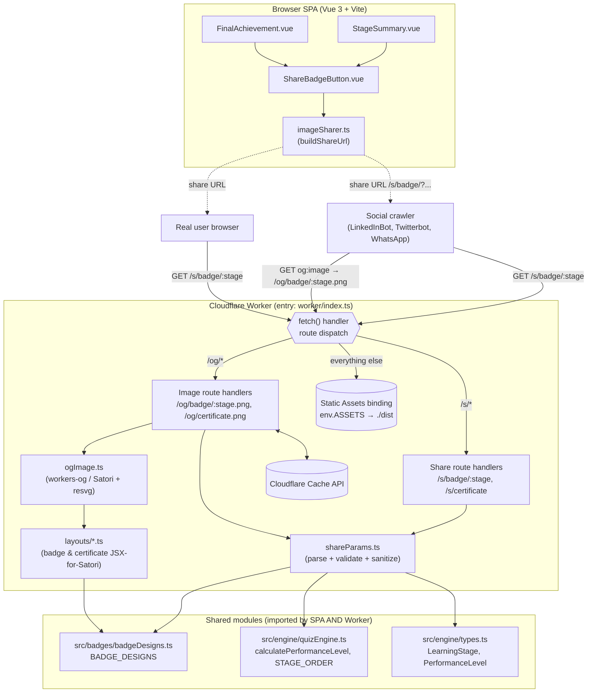
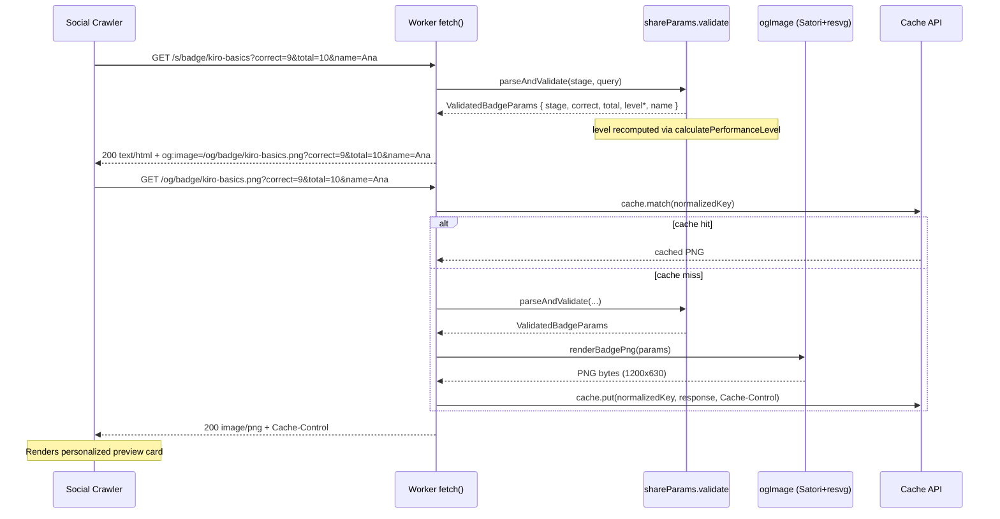
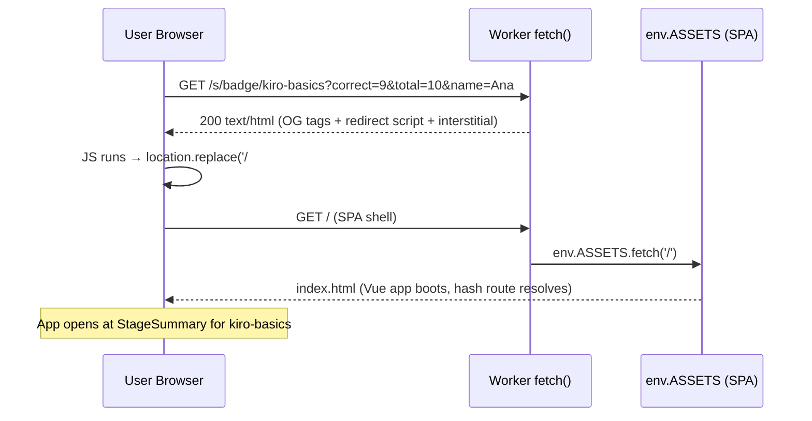
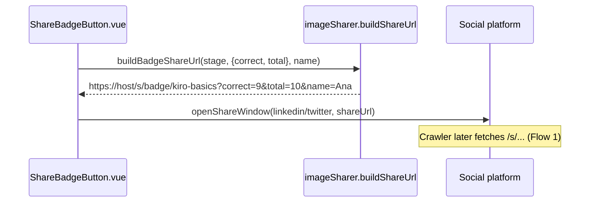

# Design Document: Dynamic Social Share Preview

## Overview

Today, when a Kiro Quest user shares a link to LinkedIn, Twitter/X, or WhatsApp, the
crawler that builds the link preview sees only the static Open Graph tags in
`index.html` (`og:image` points at `/logo.svg`). The personalized badge/certificate the
user generated lives only as a client-side PNG `Blob` produced by
`src/badges/badgeRenderer.ts` / `certificateRenderer.ts` (HTML5 Canvas) — crawlers can
never fetch it, and the share URL is a hash route (`/#/summary/kiro-basics`) whose
fragment is stripped by crawlers anyway.

This feature adds a **personalized, crawlable social preview** rendered **at the
Cloudflare edge**. We extend the existing Cloudflare Workers deployment (which currently
just serves Vite static assets via `wrangler.jsonc` `assets.directory: ./dist`) with a
Worker `fetch` handler that adds two new families of routes:

1. **Share routes** (`/s/badge/:stage`, `/s/certificate`) — return tiny, crawlable HTML
   carrying per-request Open Graph + Twitter meta tags, then bounce real browsers into
   the SPA hash route.
2. **Dynamic image routes** (`/og/badge/:stage.png`, `/og/certificate.png`) — render a
   1200×630 PNG on the fly from validated URL params, using an edge-compatible image
   library (**`workers-og`** = Satori + resvg compiled to WASM), because the Workers
   runtime has **no DOM and no Canvas API**.

The achievement is encoded entirely in URL query params (stage, correct, total, optional
name). The performance level is **never trusted from the client** — it is recomputed at
the edge with the exact same `calculatePerformanceLevel` logic the SPA uses, so a forged
`?level=Mestre%20em%20Kiro` cannot produce an inconsistent card. `BADGE_DESIGNS`
(colors/icons/displayName), the `LearningStage` union, and the pt-BR copy are reused as
the single source of truth, shared between the SPA bundle and the Worker bundle. All
user-facing copy remains pt-BR.

This document covers both the **high-level** view (architecture, sequence diagrams,
component/interface contracts, data models) and the **low-level** view (the
param-validation algorithm with pre/postconditions, edge-render and OG-HTML-injection
pseudocode, and correctness properties).

---

## Architecture



### Deployment model (grounded in the repo)

- `wrangler.jsonc` currently declares only `assets.directory: "./dist"`. Cloudflare
  Workers Static Assets supports adding a **Worker script that runs in front of the
  assets** via a `main` entry plus an `assets.binding` (e.g. `ASSETS`). The Worker
  inspects the request: `/s/*` and `/og/*` are handled in code; everything else is
  delegated to `env.ASSETS.fetch(request)` so the SPA, `logo.svg`, etc. are served
  exactly as today.
- `package.json` `build` is `vue-tsc -b && vite build` producing `./dist`. The Worker
  bundle is compiled by Wrangler (esbuild) from `worker/index.ts` at deploy time; no
  change to the Vite SPA build is required beyond sharing TypeScript modules.
- Preview deployments (per-PR) continue to work unchanged — the Worker is deployed with
  the same config.

### Required `wrangler.jsonc` changes

```jsonc
{
  "name": "kiro-quest",
  "compatibility_date": "2025-04-01",
  "compatibility_flags": ["nodejs_compat"], // workers-og / resvg-wasm friendliness
  "main": "worker/index.ts",                // NEW: Worker entry in front of assets
  "assets": {
    "directory": "./dist",
    "binding": "ASSETS",                     // NEW: lets the Worker fall through to SPA
    "html_handling": "auto-trailing-slash",
    "not_found_handling": "single-page-application" // keep SPA deep-link behavior
  }
}
```

### Crawler vs. user handling (design decision)

We **do not** rely on User-Agent sniffing as the primary mechanism (bot UA lists are
incomplete and spoofable). Instead the `/s/*` route **always returns the same OG HTML**
for everyone. That HTML contains:

- The per-request OG/Twitter meta tags (crawlers read these and stop).
- A `<script>` client-side redirect + a `<meta http-equiv="refresh">` fallback + a
  visible pt-BR "Abrir Kiro Quest" link, which sends a **real browser** into the SPA hash
  route (e.g. `/#/summary/kiro-basics`). Crawlers don't execute the script, so they keep
  the preview; humans land in the app.

This is more robust than UA sniffing and degrades gracefully when JS is disabled.

---

## Sequence Diagrams

### Flow 1 — Crawler scrapes a shared link (builds the preview card)



### Flow 2 — Real user clicks the shared link



### Flow 3 — Client builds the share URL



---

## Components and Interfaces

### Component 1: Worker entry — `worker/index.ts`

**Purpose**: The `fetch` handler that dispatches requests to share-route handlers,
image-route handlers, or the static-asset binding.

**Interface**:
```typescript
export interface Env {
  ASSETS: Fetcher; // Static Assets binding → ./dist
}

export default {
  fetch(request: Request, env: Env, ctx: ExecutionContext): Promise<Response>;
};
```

**Responsibilities**:
- Parse the URL pathname and route: `/s/badge/:stage`, `/s/certificate`,
  `/og/badge/:stage.png`, `/og/certificate.png`, else delegate to `env.ASSETS.fetch`.
- Translate thrown `ShareParamError` into the right HTTP status (400) with a safe body.
- Never throw an unhandled error to the runtime (wrap handlers in try/catch).

### Component 2: Share-route handlers — `worker/routes/shareHtml.ts`

**Purpose**: Produce the crawlable OG HTML for `/s/*` routes.

**Interface**:
```typescript
export function handleBadgeShare(req: Request, env: Env): Response;        // /s/badge/:stage
export function handleCertificateShare(req: Request, env: Env): Response;  // /s/certificate

export interface OgMeta {
  title: string;        // pt-BR
  description: string;  // pt-BR
  imageUrl: string;     // absolute URL to /og/...png with same params
  pageUrl: string;      // absolute canonical URL of this /s/... route
  redirectHash: string; // SPA hash route, e.g. '#/summary/kiro-basics'
}

export function renderOgHtml(meta: OgMeta): string; // returns full HTML document string
```

**Responsibilities**:
- Validate params (delegates to `shareParams`).
- Build absolute `og:image` URL pointing at the matching `/og/...png` with the SAME
  normalized params.
- Emit OG + Twitter tags, redirect script, `<noscript>`/`<meta refresh>` fallback, and a
  pt-BR interstitial link.
- HTML-escape every interpolated value.

### Component 3: Image-route handlers — `worker/routes/ogImage.ts`

**Purpose**: Render and return the dynamic PNG.

**Interface**:
```typescript
export function handleBadgeImage(req: Request, env: Env, ctx: ExecutionContext): Promise<Response>;
export function handleCertificateImage(req: Request, env: Env, ctx: ExecutionContext): Promise<Response>;

export interface OgImageRenderer {
  renderBadgePng(params: ValidatedBadgeParams, fonts: FontSet): Promise<Uint8Array>;
  renderCertificatePng(params: ValidatedCertificateParams, fonts: FontSet): Promise<Uint8Array>;
}
```

**Responsibilities**:
- Validate params; on failure return 400.
- Check the Cache API first; on miss, render via `workers-og` and `cache.put` using
  `ctx.waitUntil`.
- Set `Content-Type: image/png` and `Cache-Control` headers.

### Component 4: Param validation — `worker/shareParams.ts`

**Purpose**: The single, shared, strict parser/validator/sanitizer for all share params.
Importable by both `/s/*` and `/og/*` handlers, and unit-testable under vitest with no
Worker runtime.

**Interface**:
```typescript
export const MAX_TOTAL = 100;       // upper bound on question count
export const MAX_NAME_LENGTH = 40;  // cap printed name length

export interface ValidatedBadgeParams {
  stage: LearningStage;          // allowlisted
  correct: number;               // 0 <= correct <= total
  total: number;                 // 1 <= total <= MAX_TOTAL
  level: PerformanceLevel;       // RECOMPUTED, never trusted from input
  name: string;                  // sanitized plain text, length-capped ('' if absent)
}

export interface ValidatedCertificateParams {
  totalCorrect: number;
  totalQuestions: number;        // 1..(MAX_TOTAL * 11)
  percentage: number;            // derived
  level: PerformanceLevel;       // RECOMPUTED
  name: string;                  // sanitized
}

export class ShareParamError extends Error {
  constructor(public readonly reason: string) { super(reason); }
}

export function parseBadgeParams(stageSegment: string, query: URLSearchParams): ValidatedBadgeParams;
export function parseCertificateParams(query: URLSearchParams): ValidatedCertificateParams;

export function sanitizeName(raw: string | null): string;     // escape + cap
export function buildNormalizedQuery(p: ValidatedBadgeParams | ValidatedCertificateParams): string;
```

**Responsibilities**:
- Reject non-allowlisted stage (must be in `STAGE_ORDER` / `LearningStage`).
- Parse `correct`/`total` as bounded non-negative integers; reject NaN, negatives,
  `correct > total`, `total > MAX_TOTAL`, `total < 1`.
- **Recompute `level`** via `calculatePerformanceLevel(correct, total)`; ignore any
  client-supplied `level`.
- Sanitize `name`: trim, strip control chars, HTML-escape, cap at `MAX_NAME_LENGTH`.
- Produce a normalized query string so the cache key is stable.

### Component 5: OG layouts — `worker/layouts/badgeLayout.ts`, `certificateLayout.ts`

**Purpose**: Express the 1200×630 visual layouts as Satori-compatible element trees
(HTML/JSX subset + inline CSS), reusing `BADGE_DESIGNS` and pt-BR copy.

**Interface**:
```typescript
// Returns a Satori "element" (React-element-shaped object). We use the JSX-free
// object form to avoid adding a JSX toolchain to the Worker bundle.
export function badgeElement(p: ValidatedBadgeParams): SatoriNode;
export function certificateElement(p: ValidatedCertificateParams): SatoriNode;
```

**Responsibilities**:
- Map `p.stage` → `BADGE_DESIGNS[p.stage]` for `primaryColor`, `secondaryColor`, `icon`,
  `displayName`.
- Lay out icon, displayName, `correct/total`, level label, branding, and (certificate)
  name + stats using the CSS subset Satori supports (flexbox only).
- All literal copy in pt-BR.

### Component 6: Font loading — `worker/fonts.ts`

**Purpose**: Provide font buffers to Satori (the Workers runtime has no system fonts).

**Interface**:
```typescript
export interface FontSet { regular: ArrayBuffer; bold: ArrayBuffer; }
export function loadFonts(): Promise<FontSet>;
```

**Responsibilities**:
- Load a bundled woff/ttf (e.g. Inter or Noto Sans, which covers pt-BR diacritics)
  imported as a binary asset at build time — **not** fetched from a user-controlled URL
  (SSRF guard).
- Memoize across invocations within an isolate.
- Document emoji handling: badge `icon` glyphs (emoji) require either an emoji font in
  the `FontSet` or Satori's `graphemeImages`/`loadAdditionalAsset` callback bound to a
  **fixed, bundled** emoji set (no remote fetch on user input).

### Component 7: Client share-URL builder — `src/badges/imageSharer.ts` (extended)

**Purpose**: Build the crawlable, non-hash share URL instead of `window.location.origin`.

**Interface**:
```typescript
export function buildBadgeShareUrl(
  stage: LearningStage,
  score: { correct: number; total: number },
  name?: string,
): string; // -> `${origin}/s/badge/${stage}?correct=..&total=..&name=..`

export function buildCertificateShareUrl(
  stats: { totalCorrect: number; totalQuestions: number },
  name?: string,
): string; // -> `${origin}/s/certificate?correct=..&total=..&name=..`
```

**Responsibilities**:
- Build absolute URLs from `window.location.origin` + the new `/s/...` path.
- `encodeURIComponent` every param value (existing escaping discipline preserved).
- Keep the existing download + native Web Share (image blob) paths untouched;
  `openShareWindow` now passes the `/s/...` URL instead of the bare origin so LinkedIn/X
  crawl the personalized card.

---

## Data Models

### Model 1: Raw query input (untrusted)

```typescript
// As received from URLSearchParams — every field is `string | null` and UNTRUSTED.
interface RawShareQuery {
  correct: string | null;
  total: string | null;
  name: string | null;
  level: string | null; // present but IGNORED (recomputed)
}
```

**Validation Rules**:
- `stage` (path segment) MUST be a member of `STAGE_ORDER`.
- `correct`, `total` MUST parse to integers via a strict integer regex (`^\d+$`).
- `name` is optional; absence → `''`.
- `level` is read for nothing; never used to drive output.

### Model 2: `ValidatedBadgeParams` / `ValidatedCertificateParams`

(Shown in Component 4.) **Invariants** (post-validation):
- `0 <= correct <= total <= MAX_TOTAL` (badge); `1 <= total`.
- `level === calculatePerformanceLevel(correct, total)`.
- `name.length <= MAX_NAME_LENGTH` and contains no `<`, `>`, `&`, `"`, `'`, or control
  chars (escaped/stripped).
- `percentage === Math.round((totalCorrect / totalQuestions) * 100)` (certificate).

### Model 3: `OgMeta`

(Shown in Component 2.) All string fields are pt-BR and HTML-escaped before injection.
`imageUrl` and `pageUrl` are absolute, same-origin URLs.

### Cache key model

The cache key is the **canonicalized image request URL**: scheme+host+path +
`buildNormalizedQuery(params)` (params sorted, name URL-encoded, level OMITTED since it's
derived). This guarantees `?total=10&correct=9` and `?correct=9&total=10` hit the same
cache entry.

---

## Algorithmic Pseudocode (Low-Level Design)

### Algorithm: `parseBadgeParams` (param validation, with formal spec)

```typescript
function parseBadgeParams(stageSegment: string, query: URLSearchParams): ValidatedBadgeParams
```

**Preconditions**:
- `stageSegment` is the raw `:stage` path segment (may be `"kiro-basics.png"` for image
  routes; caller strips the extension before calling, or this fn strips a trailing
  `.png`).
- `query` is a `URLSearchParams` (possibly empty); all values untrusted.

**Postconditions**:
- Returns a `ValidatedBadgeParams` satisfying ALL invariants in Model 2, OR throws
  `ShareParamError` (never returns a partially-valid object).
- The returned `level` is independent of any input `level` param.
- No exception other than `ShareParamError` escapes.

**Loop invariants**: N/A (no unbounded loops).

```pascal
ALGORITHM parseBadgeParams(stageSegment, query)
BEGIN
  // 1. Normalize + allowlist the stage
  stage ← stripSuffix(stageSegment, ".png")
  IF stage NOT IN STAGE_ORDER THEN
    THROW ShareParamError("invalid_stage")
  END IF

  // 2. Strict integer parse of correct/total
  correct ← parseBoundedInt(query.get("correct"), min := 0, max := MAX_TOTAL)
  total   ← parseBoundedInt(query.get("total"),   min := 1, max := MAX_TOTAL)

  // 3. Cross-field bound
  IF correct > total THEN
    THROW ShareParamError("correct_exceeds_total")
  END IF

  // 4. RECOMPUTE level — never trust client input
  level ← calculatePerformanceLevel(correct, total)

  // 5. Sanitize optional name
  name ← sanitizeName(query.get("name"))

  RETURN { stage, correct, total, level, name }
END

ALGORITHM parseBoundedInt(raw, min, max)
BEGIN
  IF raw = NULL OR NOT matches(raw, /^[0-9]{1,4}$/) THEN
    THROW ShareParamError("invalid_integer")
  END IF
  n ← toInteger(raw)
  IF n < min OR n > max THEN
    THROW ShareParamError("out_of_range")
  END IF
  RETURN n
END

ALGORITHM sanitizeName(raw)
BEGIN
  IF raw = NULL THEN RETURN ""
  s ← trim(raw)
  s ← removeControlChars(s)             // strip U+0000..U+001F, U+007F
  IF length(s) > MAX_NAME_LENGTH THEN
    s ← substring(s, 0, MAX_NAME_LENGTH)
  END IF
  RETURN htmlEscape(s)                  // & < > " '  →  entities
END
```

### Algorithm: `handleBadgeImage` (edge render + cache)

**Preconditions**: `request` is a GET to `/og/badge/:stage.png`; `env`, `ctx` valid.

**Postconditions**: Returns 200 `image/png` with `Cache-Control` on success, or 400 on
`ShareParamError`, or 500 on unexpected render failure (with a safe body). On cache miss,
the rendered response is stored asynchronously via `ctx.waitUntil`.

```pascal
ALGORITHM handleBadgeImage(request, env, ctx)
BEGIN
  url ← new URL(request.url)

  // 1. Validate (may throw ShareParamError → caught by entry handler → 400)
  params ← parseBadgeParams(lastPathSegment(url.pathname), url.searchParams)

  // 2. Build a STABLE cache key from normalized params
  cacheKey ← url.origin + url.pathname + "?" + buildNormalizedQuery(params)
  cache ← caches.default
  cached ← cache.match(cacheKey)
  IF cached ≠ NULL THEN
    RETURN cached
  END IF

  // 3. Cold render
  fonts ← loadFonts()                          // memoized
  element ← badgeElement(params)               // uses BADGE_DESIGNS
  pngBytes ← satoriRenderToPng(element, {
                 width := 1200, height := 630, fonts := fonts })

  // 4. Build response with cache headers
  response ← new Response(pngBytes, {
      headers := {
        "Content-Type": "image/png",
        "Cache-Control": "public, max-age=86400, s-maxage=604800, immutable"
      }
  })

  // 5. Populate edge cache without blocking the response
  ctx.waitUntil(cache.put(cacheKey, response.clone()))
  RETURN response
END
```

### Algorithm: OG HTML injection (`renderOgHtml`)

**Preconditions**: `meta` fields are already HTML-escaped pt-BR strings; `imageUrl`,
`pageUrl` are absolute same-origin URLs; `redirectHash` begins with `#/`.

**Postconditions**: Returns a complete, valid HTML document string containing exactly one
of each required OG/Twitter tag, a JS redirect, a no-JS fallback, and no unescaped
interpolation.

```pascal
ALGORITHM renderOgHtml(meta)
BEGIN
  // All ${...} values are pre-escaped by the caller (see sanitizeName / htmlEscape).
  RETURN concat(
    "<!DOCTYPE html><html lang=\"pt-BR\"><head>",
    "<meta charset=\"UTF-8\"/>",
    "<title>", meta.title, "</title>",
    "<meta property=\"og:type\" content=\"website\"/>",
    "<meta property=\"og:site_name\" content=\"Kiro Quest\"/>",
    "<meta property=\"og:title\" content=\"", meta.title, "\"/>",
    "<meta property=\"og:description\" content=\"", meta.description, "\"/>",
    "<meta property=\"og:image\" content=\"", meta.imageUrl, "\"/>",
    "<meta property=\"og:image:width\" content=\"1200\"/>",
    "<meta property=\"og:image:height\" content=\"630\"/>",
    "<meta property=\"og:url\" content=\"", meta.pageUrl, "\"/>",
    "<meta property=\"og:locale\" content=\"pt_BR\"/>",
    "<meta name=\"twitter:card\" content=\"summary_large_image\"/>",
    "<meta name=\"twitter:title\" content=\"", meta.title, "\"/>",
    "<meta name=\"twitter:description\" content=\"", meta.description, "\"/>",
    "<meta name=\"twitter:image\" content=\"", meta.imageUrl, "\"/>",
    // No-JS fallback for the human visitor:
    "<meta http-equiv=\"refresh\" content=\"0; url=/", meta.redirectHash, "\"/>",
    "</head><body>",
    "<p>Abrindo o Kiro Quest… ",
    "<a href=\"/", meta.redirectHash, "\">Clique aqui se nada acontecer.</a></p>",
    // JS redirect (crawlers don't execute this; humans do):
    "<script>location.replace('/", meta.redirectHash, "');</script>",
    "</body></html>"
  )
END
```

### Client: `buildBadgeShareUrl`

```pascal
ALGORITHM buildBadgeShareUrl(stage, score, name)
BEGIN
  origin ← (window.location.origin OR "https://kiro-quest.trilha.workers.dev")
  q ← "correct=" + encodeURIComponent(score.correct)
       + "&total=" + encodeURIComponent(score.total)
  IF name AND length(trim(name)) > 0 THEN
    q ← q + "&name=" + encodeURIComponent(name)
  END IF
  RETURN origin + "/s/badge/" + stage + "?" + q
END
```

---

## Example Usage

```typescript
// --- Client (StageSummary.vue → ShareBadgeButton → imageSharer) ---
const shareUrl = buildBadgeShareUrl('kiro-basics', { correct: 9, total: 10 }, 'Ana');
// => "https://kiro-quest.trilha.workers.dev/s/badge/kiro-basics?correct=9&total=10&name=Ana"
openShareWindow('linkedin', shareUrl); // LinkedIn crawls /s/badge/... and shows the card

// --- Worker entry dispatch (worker/index.ts) ---
export default {
  async fetch(request: Request, env: Env, ctx: ExecutionContext): Promise<Response> {
    const { pathname } = new URL(request.url);
    try {
      if (pathname.startsWith('/s/badge/'))        return handleBadgeShare(request, env);
      if (pathname === '/s/certificate')           return handleCertificateShare(request, env);
      if (pathname.startsWith('/og/badge/'))       return await handleBadgeImage(request, env, ctx);
      if (pathname === '/og/certificate.png')      return await handleCertificateImage(request, env, ctx);
      return env.ASSETS.fetch(request); // SPA + static assets, unchanged
    } catch (err) {
      if (err instanceof ShareParamError) return new Response('Parâmetros inválidos', { status: 400 });
      return new Response('Erro interno', { status: 500 });
    }
  },
};
```

---

## Correctness Properties

These are stated as universally-quantified properties and map directly to the
property-based tests below (fast-check is already a project dependency).

1. **Stage allowlist**: ∀ raw stage segment `s`. If `s ∉ STAGE_ORDER`, then
   `parseBadgeParams(s, q)` throws `ShareParamError` for every `q`.
2. **Score bounds**: ∀ integers `c, t`. `parseBadgeParams` returns successfully **iff**
   `0 ≤ c ≤ t ≤ MAX_TOTAL ∧ t ≥ 1`; otherwise it throws.
3. **Level is recomputed & consistent**: ∀ valid `(c, t)` and ∀ arbitrary `level` query
   value `L`. `parseBadgeParams(...).level === calculatePerformanceLevel(c, t)`
   regardless of `L` (forged level is ignored).
4. **Name is bounded & escaped**: ∀ strings `n`. `sanitizeName(n).length ≤ MAX_NAME_LENGTH`
   ∧ `sanitizeName(n)` contains none of `< > & " '` unescaped ∧ no control chars.
5. **Normalization is order-insensitive**: ∀ valid param sets `p`. `buildNormalizedQuery`
   produces the same string for any input query-param ordering ⇒ stable cache key.
6. **Render contract**: ∀ valid params. `handleBadgeImage` resolves to a `Response` with
   status 200, `Content-Type: image/png`, and a `Cache-Control` header.
7. **No open redirect**: ∀ inputs. `meta.redirectHash` is always a same-origin SPA hash
   route (begins with `#/`); the OG HTML never emits an absolute external redirect.
8. **Fallback preserved**: a request to `/` or any `/s|/og` URL **without** params still
   yields a valid response (SPA root keeps its static `index.html` OG card).

---

## Error Handling

### Scenario 1: Invalid / missing params
**Condition**: non-allowlisted stage, non-integer/out-of-range score, `correct > total`.
**Response**: `/og/*` → `400` `text/plain` "Parâmetros inválidos" (no image render
attempted). `/s/*` → either `400`, or (preferred for resilience) fall back to the
**generic static OG card** + redirect to `/#/stages`, so a malformed share link still
opens the app rather than showing an error.
**Recovery**: user lands in the SPA; no state is persisted.

### Scenario 2: Image render failure (Satori/resvg throws, font load fails)
**Condition**: unexpected exception in `satoriRenderToPng` or `loadFonts`.
**Response**: `500` "Erro interno" for `/og/*`; the `/s/*` HTML still references the image
URL — crawlers that fail to fetch the image fall back to title/description only.
**Recovery**: error is caught in the entry handler; the isolate is not torn down.

### Scenario 3: Crawler ignores the SVG/PNG
**Condition**: a platform that rejects the image format.
**Response**: title/description tags still produce a recognized card (current behavior is
preserved as a floor).

### Scenario 4: Cache write failure
**Condition**: `cache.put` rejects.
**Response**: wrapped in `ctx.waitUntil`; failure is non-fatal — the response is already
returned. Next request simply re-renders.

---

## Testing Strategy

### Unit Testing (vitest, no Worker runtime needed)
- `shareParams.ts`: stage allowlist, integer parsing, bounds, `correct > total`,
  name capping/escaping, level recomputation, `buildNormalizedQuery` stability.
- `imageSharer.buildBadgeShareUrl` / `buildCertificateShareUrl`: correct path, encoding,
  optional-name omission, origin fallback. (Extends existing `imageSharer.test.ts`.)
- `renderOgHtml`: snapshot of the emitted HTML for known meta; assert all required
  OG/Twitter tags present and values escaped.
- `layouts/*`: assert the returned Satori element tree references the right
  `BADGE_DESIGNS[stage]` colors/icon/displayName and pt-BR copy (snapshot of the element
  object — feasible because layouts return plain objects, not pixels).

### Property-Based Testing (fast-check, already installed)
Targets the param validator (the highest-risk, purest surface):
- **Prop 2 (bounds)**: `fc.integer()` × `fc.integer()` → success iff invariant holds.
- **Prop 3 (level)**: ∀ valid `(c,t)` and ∀ `fc.string()` as forged `level` →
  result.level equals `calculatePerformanceLevel(c,t)`.
- **Prop 4 (name)**: `fc.fullUnicodeString()` → output length ≤ cap, no unescaped
  metacharacters, no control chars.
- **Prop 5 (normalization)**: shuffle param order → identical normalized query.
- **Prop 1 (stage)**: `fc.string()` not in `STAGE_ORDER` → always throws.

### Worker Handler Testing
- Use **`@cloudflare/vitest-pool-workers`** (Miniflare-backed) to exercise
  `worker/index.ts` end-to-end: assert `/og/badge/kiro-basics.png?correct=9&total=10`
  returns **200 + `image/png` + `Cache-Control`**; assert `/s/badge/...` returns HTML
  containing the expected `og:image` URL; assert unknown paths fall through to
  `env.ASSETS`.
- Satori pixel output is **not** asserted pixel-wise. Tests assert status,
  content-type, cache headers, and (where feasible) a snapshot of the Satori element
  tree. A lightweight "smoke" assertion checks the PNG magic bytes (`89 50 4E 47`).

### Integration / Regression
- Verify the static `index.html` OG card is unchanged (backwards-compat floor).
- Verify SPA deep links (`/#/summary/...`) still resolve after the `/s/*` redirect.

---

## Performance Considerations

- **Cold vs. warm render**: Satori + resvg WASM has a one-time WASM init cost per isolate
  (tens–low-hundreds of ms) plus per-render layout/rasterize cost. Warm renders within a
  live isolate are much cheaper; the **Cache API** makes the common case (a popular shared
  link) a near-zero-cost cache hit.
- **Edge caching**: `Cache-Control: public, max-age=86400, s-maxage=604800, immutable`
  plus the normalized cache key means each unique achievement card is rendered at most
  once per cache lifetime per PoP. Optionally set `cf: { cacheEverything: true }` on
  sub-requests.
- **Size limits**: output is a 1200×630 PNG (typically tens–low-hundreds of KB). Bounded
  params (`MAX_TOTAL`, `MAX_NAME_LENGTH`) cap the input space, so the number of distinct
  cacheable cards is finite and small.
- **Font memoization**: fonts are loaded once per isolate and reused.

## Security Considerations

- **Input validation**: strict allowlist for `stage`; bounded integer parsing; cross-field
  checks. Invalid input never reaches the renderer.
- **Output escaping**: `name` is HTML-escaped before HTML injection and is rendered by
  Satori as text (not markup), preventing XSS in both the `/s/*` HTML and the image.
- **Level forgery prevention**: `level` is recomputed server-side; a user cannot mint a
  "Mestre em Kiro" card from a low score.
- **No open redirect**: redirect targets are always same-origin SPA hash routes built
  from the validated `stage`; no user-controlled absolute URL is ever used as a redirect.
- **No SSRF**: fonts and emoji assets are **bundled** (or fetched from a fixed, trusted,
  hard-coded URL) — never from a user-supplied URL/param. The renderer never fetches a
  remote image chosen by the client.
- **Abuse / DoS**: bounded param space + edge caching strongly limit arbitrary
  image-generation cost; an attacker can only enumerate a small finite set of cards, most
  of which become cache hits. Consider Cloudflare WAF rate-limiting on `/og/*` if needed.
- **No PII persistence**: the optional `name` is rendered into a cached image but never
  written to a database or log; it lives only in the URL and the edge cache entry.

---

## Backwards Compatibility / Migration

- The static OG tags in `index.html` (root `og:image = /logo.svg`, title/description)
  **remain unchanged** and serve as the fallback for the app root and any link without
  params.
- Existing client paths — Canvas-based download (`downloadImage`) and native Web Share of
  the image blob (`shareViaWebAPI`) — are **kept as-is**. Only the social share-window URL
  changes from `window.location.origin` to the crawlable `/s/...` URL.
- The Canvas renderers (`badgeRenderer.ts`, `certificateRenderer.ts`) stay for the
  in-app preview/download; the edge re-expresses the same visual design in Satori. The
  shared source of truth is `BADGE_DESIGNS` + pt-BR copy, so the two stay visually aligned.
- No data migration is required (no persistence is added).

---

## File / Module Structure

```
kiro-quest/
├── wrangler.jsonc                 # MODIFIED: add main + assets.binding
├── package.json                   # MODIFIED: add "workers-og" (+ bundled font asset)
├── worker/                        # NEW: Cloudflare Worker code (bundled by Wrangler)
│   ├── index.ts                   # fetch() entry + route dispatch
│   ├── shareParams.ts             # parse/validate/sanitize (shared, vitest-testable)
│   ├── fonts.ts                   # bundled font/emoji buffers for Satori
│   ├── routes/
│   │   ├── shareHtml.ts           # /s/badge/:stage, /s/certificate → OG HTML
│   │   └── ogImage.ts             # /og/badge/:stage.png, /og/certificate.png → PNG
│   ├── layouts/
│   │   ├── badgeLayout.ts         # Satori element tree for the badge (uses BADGE_DESIGNS)
│   │   └── certificateLayout.ts   # Satori element tree for the certificate
│   └── __tests__/
│       ├── shareParams.test.ts            # unit + fast-check property tests
│       ├── shareParams.property.test.ts
│       ├── shareHtml.test.ts              # OG HTML snapshot + escaping
│       └── worker.handler.test.ts         # @cloudflare/vitest-pool-workers
├── src/
│   ├── badges/
│   │   ├── badgeDesigns.ts        # REUSED (single source of truth, imported by worker/)
│   │   └── imageSharer.ts         # MODIFIED: add buildBadgeShareUrl/buildCertificateShareUrl
│   └── engine/
│       ├── quizEngine.ts          # REUSED: calculatePerformanceLevel, STAGE_ORDER
│       └── types.ts               # REUSED: LearningStage, PerformanceLevel
└── assets/fonts/                  # NEW: bundled woff/ttf (e.g. Inter / Noto Sans) for Satori
```

**Build wiring**:
- Add `workers-og` (Satori + resvg-wasm) to `dependencies`. Evaluation: `workers-og` is
  purpose-built for Cloudflare Workers and bundles the WASM; alternatives `@cf-wasm/og`
  or raw `satori` + `@resvg/resvg-wasm` are equivalent fallbacks. Trade-off: the visual
  layout must be re-expressed as Satori HTML/JSX (flexbox CSS subset) rather than reusing
  the Canvas drawing code — but `BADGE_DESIGNS` colors/icons/labels and pt-BR copy are
  reused verbatim.
- The font file is imported as a binary module (Wrangler/esbuild supports importing
  `.ttf`/`.woff` as `ArrayBuffer`) so no network fetch is needed at request time.
- `worker/` shares `src/` modules via the existing `@` path alias (mirror it in the
  Worker's tsconfig/esbuild config).
