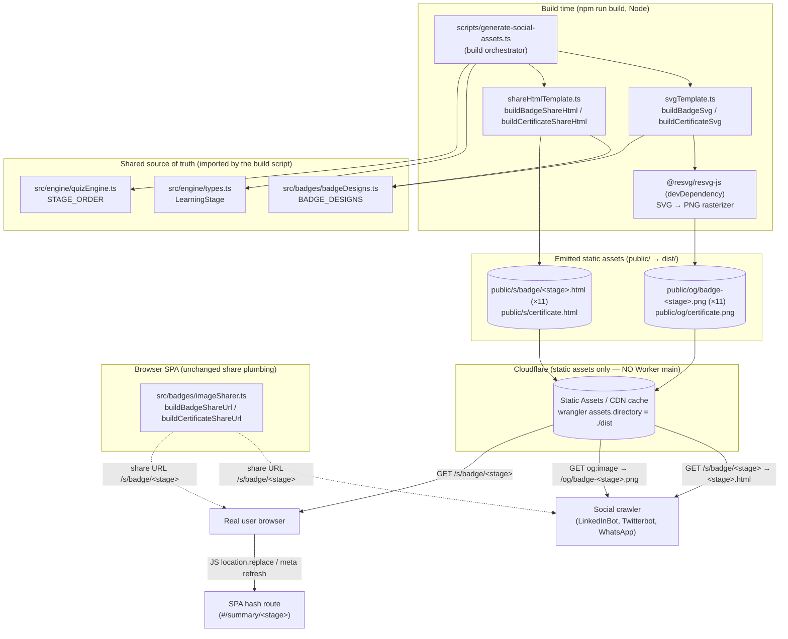
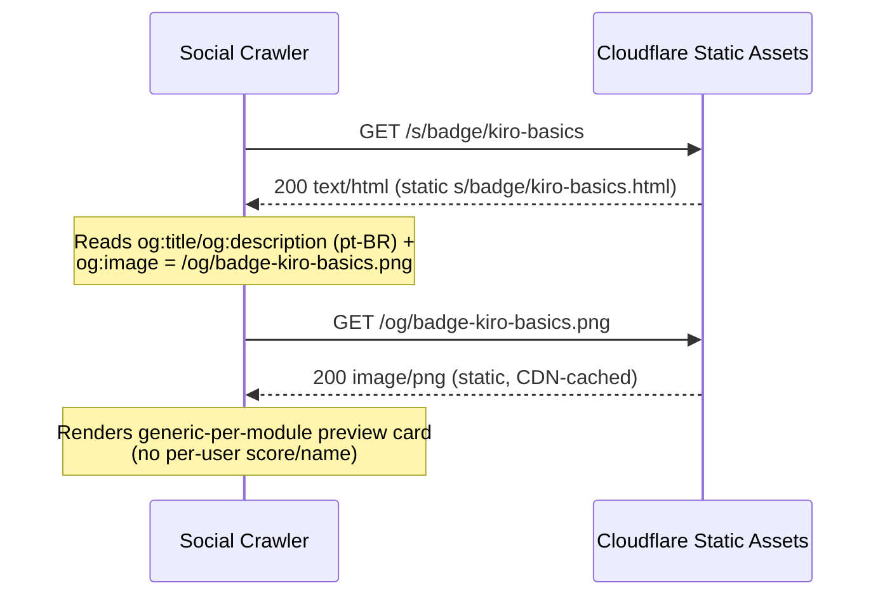
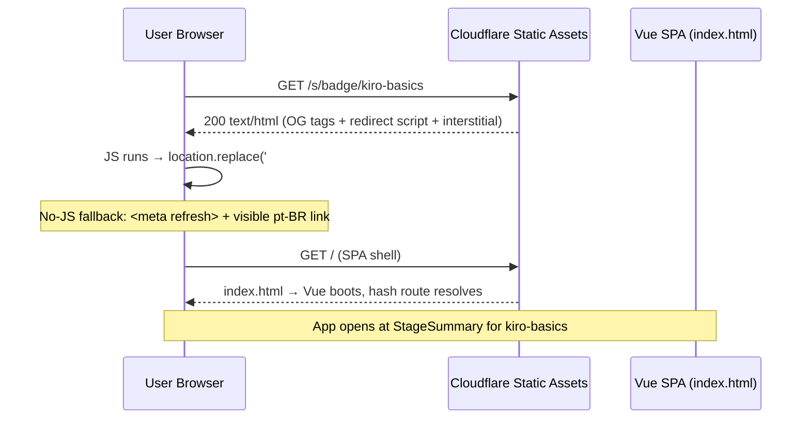
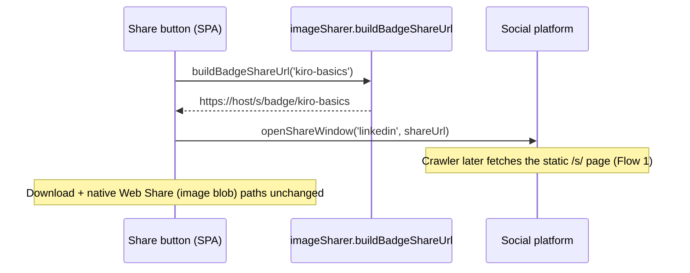
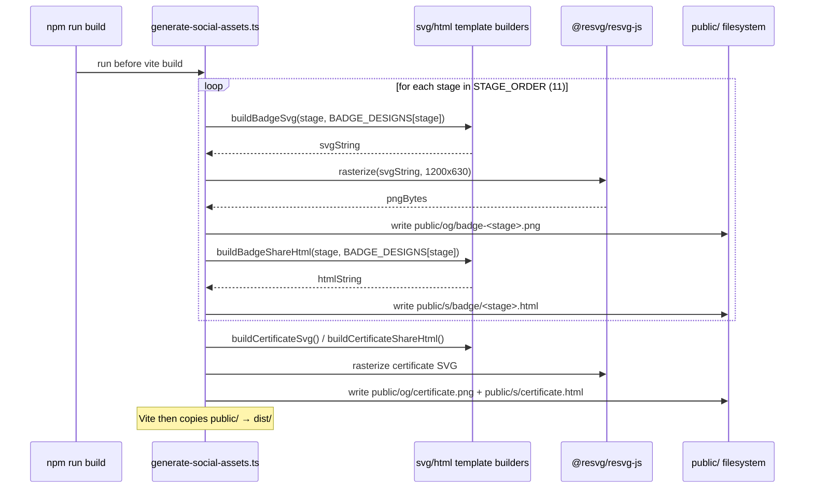

# Design Document: Static Social Share Preview (Build-Time, Per-Module)

## Overview

Today, when a Kiro Quest user shares a link to LinkedIn, Twitter/X, or WhatsApp, the
crawler that builds the link preview sees only the static Open Graph tags in
`index.html` (`og:image` points at `/logo.svg`). Two structural facts defeat a richer
preview:

1. The personalized badge/certificate the user generated lives only as a client-side PNG
   `Blob` (HTML5 Canvas). Crawlers never run that code and cannot fetch the blob.
2. Share URLs are SPA **hash routes** (e.g. `/#/summary/kiro-basics`). Crawlers strip the
   `#` fragment, so every shared link looks identical to them.

**Approach pivot (no new runtime cost).** A previous revision of this document proposed an
**edge-rendered** solution: a Cloudflare Worker that rendered a personalized 1200×630 PNG
on every request via Satori + resvg WASM. After a cost review, that approach was rejected
because runtime image rendering on Cloudflare requires moving off the Workers Free plan
(the Free plan's 10ms CPU and bundle-size limits make on-the-fly rasterization impractical),
i.e. it implies a **Workers Paid plan**. This document replaces that approach with a
**static, build-time** design that costs nothing extra to run.

### What this design does

- **Generic-per-module previews.** At **build time** we generate one static 1200×630 PNG
  per learning module (11 modules) plus one generic certificate PNG, and one tiny static
  crawlable HTML "share page" per module (plus one for the certificate). Each share page
  carries per-module Open Graph + Twitter tags whose `og:image` points at the matching
  static PNG. Crawlers read the tags and show a recognizable card; real browsers are
  redirected into the SPA hash route.
- **Zero runtime rendering.** Cloudflare serves static assets for free and unlimited.
  There is **no runtime image generation**, so the Workers Free-plan CPU/size limits are
  irrelevant. **No Workers Paid plan, no `main` Worker entry, no KV/R2/D1/Durable
  Objects** are introduced. `wrangler.jsonc` keeps serving `./dist` exactly as today.

### Accepted trade-off (personalization)

The crawlable preview card is **generic per module** — it shows the module's badge design
and pt-BR title, but **NOT** the individual user's score or name. This is the explicit
trade-off the user accepted in exchange for zero new cost. The user's **actual
personalized** badge/certificate is still produced and shared through the **existing
download + native Web Share (image blob)** paths, which remain **completely unchanged**.
So personalization is preserved where it already worked (direct share/download); only the
link-unfurl preview is generic.

### Single source of truth

The build reuses the existing design tokens and copy so the preview never drifts from the
in-app badges:

- `src/badges/badgeDesigns.ts` → `BADGE_DESIGNS` (`icon`, `primaryColor`,
  `secondaryColor`, `displayName`) and the pt-BR copy.
- `src/engine/types.ts` → the `LearningStage` union.
- `src/engine/quizEngine.ts` → `STAGE_ORDER` (the canonical 11-stage list).

All user-facing copy remains in Brazilian Portuguese (pt-BR).

This document covers both the **high-level** view (architecture, sequence diagrams,
component/interface contracts, data models) and the **low-level** view (pure template
builders and the build script, each with pre/postconditions and correctness properties).

---

## Architecture

Everything personalized-to-the-module is computed **at build time** and emitted as plain
files into `public/` (Vite copies `public/` verbatim into `dist/`). At **runtime** there
is only Cloudflare's static-asset CDN — no code executes per request.



### Deployment model (grounded in the repo)

- `wrangler.jsonc` currently declares only `assets.directory: "./dist"`. **It stays that
  way.** No `main` entry, no `assets.binding`, no compatibility flags for WASM are added.
  The generated `public/og/*.png` and `public/s/**/*.html` are ordinary files under
  `dist/` and are served directly by Cloudflare Static Assets.
- `package.json` `build` is `vue-tsc -b && vite build`. We add a build step that runs the
  generator **before** `vite build` (so the files exist in `public/` when Vite copies it),
  or as a Vite plugin hook. The rasterizer is a **devDependency only** — it never ships in
  the SPA bundle and never runs at request time.

### Static routing detail: `/s/badge/<stage>` → `<stage>.html`

Cloudflare Static Assets resolves "pretty" paths to `.html` files via its
`html_handling` behavior (auto-trailing-slash / drop `.html`), so a request to
`/s/badge/kiro-basics` is served from `public/s/badge/kiro-basics.html`. Because a **real
file exists** at that path, it takes precedence over the SPA fallback
(`not_found_handling: single-page-application`) — the SPA fallback only fires for paths
that have **no** matching asset. To make this robust regardless of project-wide
`html_handling` configuration, the generator MAY additionally emit a directory-style file
(`public/s/badge/<stage>/index.html`); the recommended configuration is documented below.

```jsonc
// wrangler.jsonc — recommended (NO Worker main, NO bindings)
{
  "name": "kiro-quest",
  "compatibility_date": "2025-04-01",
  "assets": {
    "directory": "./dist",
    "html_handling": "auto-trailing-slash",          // serves /s/badge/x from x.html
    "not_found_handling": "single-page-application"   // SPA fallback for unknown paths only
  }
}
```

### Crawler vs. user handling (design decision)

We **do not** use User-Agent sniffing (bot UA lists are incomplete and spoofable, and we
have no server to sniff with — these are static files). Each `/s/*` HTML file is identical
for everyone and contains:

- Per-module OG/Twitter meta tags (crawlers read these and stop — they don't run JS).
- A `<script>location.replace('#/summary/<stage>')</script>` redirect, a
  `<meta http-equiv="refresh">` no-JS fallback, and a visible pt-BR interstitial link, all
  pointing at a **same-origin SPA hash route**. Real browsers execute the redirect and land
  in the app; crawlers keep the preview.

This degrades gracefully (works with JS disabled) and needs no runtime code.

---

## Sequence Diagrams

### Flow 1 — Crawler scrapes a shared link (builds the preview card)



### Flow 2 — Real user clicks the shared link



### Flow 3 — Client builds the share URL (in the SPA)



### Flow 4 — Build-time asset generation



---

## Components and Interfaces

### Component 1: SVG template builder — `scripts/templates/svgTemplate.ts`

**Purpose**: Pure functions that turn a stage (and its `BADGE_DESIGNS` entry) into a
1200×630 SVG string using a shared visual template. No I/O; trivially unit/property
testable.

**Interface**:
```typescript
import type { LearningStage } from '@/engine/types';
import type { BadgeDesign } from '@/badges/badgeDesigns';

export const OG_WIDTH = 1200;
export const OG_HEIGHT = 630;

/** Build the social-card SVG for a single module badge. Pure. */
export function buildBadgeSvg(stage: LearningStage, design: BadgeDesign): string;

/** Build the generic certificate social-card SVG. Pure. */
export function buildCertificateSvg(): string;
```

**Responsibilities**:
- Lay out icon, `displayName`, and pt-BR tagline using `design.primaryColor` /
  `design.secondaryColor` (e.g. a gradient background) at exactly 1200×630.
- XML-escape any interpolated text (values come from our own `BADGE_DESIGNS`/copy, not
  user input — see Security).
- Contain no per-user data (generic per module).

### Component 2: HTML share-page builder — `scripts/templates/shareHtmlTemplate.ts`

**Purpose**: Pure functions that produce the tiny crawlable HTML document for each share
page (OG/Twitter tags + redirect + no-JS fallback + interstitial).

**Interface**:
```typescript
export interface ShareMeta {
  title: string;        // pt-BR
  description: string;  // pt-BR
  imageUrl: string;     // absolute URL to the matching static PNG
  pageUrl: string;      // absolute canonical URL of this /s/ page
  redirectHash: string; // SPA hash route, e.g. '#/summary/kiro-basics'
}

/** Assemble the full crawlable HTML document. Pure. */
export function renderShareHtml(meta: ShareMeta): string;

/** Convenience builders that derive ShareMeta from a stage / certificate. */
export function buildBadgeShareHtml(
  stage: LearningStage, design: BadgeDesign, siteOrigin: string,
): string;
export function buildCertificateShareHtml(siteOrigin: string): string;
```

**Responsibilities**:
- Emit exactly one of each required OG/Twitter tag (`og:type`, `og:site_name`, `og:title`,
  `og:description`, `og:image`, `og:image:width`=1200, `og:image:height`=630, `og:url`,
  `og:locale`=`pt_BR`, `twitter:card`=`summary_large_image`, `twitter:title`,
  `twitter:description`, `twitter:image`).
- Set `og:image` to the **absolute** URL of the matching static PNG.
- Emit a `<script>location.replace(redirectHash)</script>`, a `<meta http-equiv="refresh">`
  fallback, and a visible pt-BR interstitial link — all pointing at the same-origin hash
  route (`redirectHash` MUST begin with `#/`).
- HTML-escape every interpolated value.

### Component 3: Build orchestrator — `scripts/generate-social-assets.ts`

**Purpose**: The Node build script that wires the templates + rasterizer together and
writes all outputs into `public/`. Runs as part of `npm run build`.

**Interface**:
```typescript
export interface GenerateOptions {
  outDir: string;        // defaults to <repo>/public
  siteOrigin: string;    // canonical origin for absolute og:image/og:url
  rasterize: (svg: string, width: number, height: number) => Uint8Array; // injectable (testable)
}

export interface GenerateResult {
  pngFiles: string[];    // 12 paths: 11 badges + 1 certificate
  htmlFiles: string[];   // 12 paths: 11 badges + 1 certificate
}

export async function generateSocialAssets(opts: GenerateOptions): Promise<GenerateResult>;
```

**Responsibilities**:
- Iterate `STAGE_ORDER`; for each stage build the SVG, rasterize it to PNG, write
  `public/og/badge-<stage>.png`, build the share HTML, write `public/s/badge/<stage>.html`.
- Generate the certificate PNG + HTML once.
- Create `public/og/` and `public/s/badge/` directories as needed.
- Default `rasterize` is `@resvg/resvg-js`; it is **injected** so unit tests can pass a
  mock (avoiding heavy PNG work) and assert it is called once per stage.
- Fail the build (non-zero exit) on any template or write error (see Error Handling).

### Component 4: Client share-URL builder — `src/badges/imageSharer.ts` (extended)

**Purpose**: Build the crawlable, non-hash `/s/...` share URL (generic per module — no
per-user query params needed).

**Interface**:
```typescript
import type { LearningStage } from '@/engine/types';

/** -> `${origin}/s/badge/${stage}` */
export function buildBadgeShareUrl(stage: LearningStage): string;

/** -> `${origin}/s/certificate` */
export function buildCertificateShareUrl(): string;
```

**Responsibilities**:
- Build absolute URLs from `window.location.origin` (with a documented production-origin
  fallback when `origin` is unavailable), plus the new `/s/...` path. No per-user params.
- Update `openShareWindow` / `shareToSocial` to pass the `/s/...` URL so crawlers fetch the
  module card.
- **Keep the existing download + native Web Share (image blob) paths and the static
  `index.html` root OG fallback untouched.**

### Rasterizer choice (dev/build-time only)

We recommend **`@resvg/resvg-js`** as a devDependency: it is a fast, dependency-light
SVG→PNG rasterizer with no headless-browser requirement, runs in plain Node at build time,
and renders our flexbox-free SVG template cleanly. **`sharp`** is a viable alternative
(also supports SVG→PNG) if the project already needs image processing. Either way the
rasterizer:
- runs **only** during `npm run build` (no Workers CPU/size limits apply),
- ships in **neither** the SPA bundle **nor** any Worker (there is no Worker),
- is fully replaceable via the injected `rasterize` function for testing.

---

## Data Models

### Model 1: `BadgeDesign` (existing, reused — read-only source of truth)

```typescript
// from src/badges/badgeDesigns.ts (existing)
export interface BadgeDesign {
  icon: string;            // emoji / glyph
  primaryColor: string;    // hex
  secondaryColor: string;  // hex
  displayName: string;     // pt-BR module name
}
export const BADGE_DESIGNS: Record<LearningStage, BadgeDesign>;
```

**Invariants used by this feature**:
- `BADGE_DESIGNS` has an entry for every member of `STAGE_ORDER` (11 entries).
- Values are author-controlled constants (not user input).

### Model 2: `ShareMeta` (build-time, internal)

(Shown in Component 2.) **Invariants** (post-construction):
- All string fields are pt-BR and HTML-escaped before injection.
- `imageUrl` and `pageUrl` are absolute, same-origin URLs.
- `redirectHash` begins with `#/` (same-origin SPA route — no open redirect).

### Model 3: Emitted file layout (the contract crawlers/CDN rely on)

```text
public/
  og/
    badge-kiro-basics.png        # 1200×630
    badge-specs.png
    ... (one per STAGE_ORDER entry, 11 total)
    certificate.png              # generic certificate card
  s/
    badge/
      kiro-basics.html           # OG tags → /og/badge-kiro-basics.png
      specs.html
      ... (11 total)
    certificate.html             # OG tags → /og/certificate.png
```

**Naming contract**: for every `stage ∈ STAGE_ORDER` there is exactly one
`og/badge-<stage>.png` and one `s/badge/<stage>.html`, and the HTML's `og:image` resolves
to that PNG's absolute URL.

---

## Algorithmic Pseudocode (Low-Level Design)

### Algorithm: `buildBadgeShareHtml` (pure template builder, with formal spec)

**Preconditions**:
- `stage ∈ STAGE_ORDER`; `design === BADGE_DESIGNS[stage]`.
- `siteOrigin` is an absolute origin string (e.g. `https://kiro-quest.example`).

**Postconditions**:
- Returns a complete HTML document string containing **exactly one** of each required
  OG/Twitter tag listed in Component 2.
- `og:image` equals `siteOrigin + "/og/badge-" + stage + ".png"`.
- The redirect target begins with `#/` and is same-origin (no absolute external URL).
- Every interpolated text value is HTML-escaped.
- No per-user data is present.

**Loop invariants**: N/A (no loops).

```pascal
ALGORITHM buildBadgeShareHtml(stage, design, siteOrigin)
BEGIN
  title       ← htmlEscape("Conquista " + design.displayName + " — Kiro Quest")
  description ← htmlEscape("Veja a trilha " + design.displayName +
                           " no Kiro Quest e teste seus conhecimentos sobre o Kiro.")
  imageUrl    ← siteOrigin + "/og/badge-" + stage + ".png"
  pageUrl     ← siteOrigin + "/s/badge/" + stage
  redirectHash← "#/summary/" + stage           // same-origin SPA route

  meta ← { title, description, imageUrl, pageUrl, redirectHash }
  RETURN renderShareHtml(meta)
END

ALGORITHM renderShareHtml(meta)
BEGIN
  // meta.title / meta.description are already HTML-escaped.
  // meta.imageUrl / meta.pageUrl are absolute same-origin URLs.
  // ASSERT startsWith(meta.redirectHash, "#/")
  RETURN concat(
    "<!DOCTYPE html><html lang=\"pt-BR\"><head>",
    "<meta charset=\"UTF-8\"/>",
    "<title>", meta.title, "</title>",
    "<meta property=\"og:type\" content=\"website\"/>",
    "<meta property=\"og:site_name\" content=\"Kiro Quest\"/>",
    "<meta property=\"og:title\" content=\"", meta.title, "\"/>",
    "<meta property=\"og:description\" content=\"", meta.description, "\"/>",
    "<meta property=\"og:image\" content=\"", meta.imageUrl, "\"/>",
    "<meta property=\"og:image:width\" content=\"1200\"/>",
    "<meta property=\"og:image:height\" content=\"630\"/>",
    "<meta property=\"og:url\" content=\"", meta.pageUrl, "\"/>",
    "<meta property=\"og:locale\" content=\"pt_BR\"/>",
    "<meta name=\"twitter:card\" content=\"summary_large_image\"/>",
    "<meta name=\"twitter:title\" content=\"", meta.title, "\"/>",
    "<meta name=\"twitter:description\" content=\"", meta.description, "\"/>",
    "<meta name=\"twitter:image\" content=\"", meta.imageUrl, "\"/>",
    "<meta http-equiv=\"refresh\" content=\"0; url=", meta.redirectHash, "\"/>",
    "</head><body>",
    "<p>Abrindo o Kiro Quest… ",
    "<a href=\"", meta.redirectHash, "\">Clique aqui se nada acontecer.</a></p>",
    "<script>location.replace(", jsonQuote(meta.redirectHash), ");</script>",
    "</body></html>"
  )
END
```

### Algorithm: `buildBadgeSvg` (pure template builder)

**Preconditions**: `stage ∈ STAGE_ORDER`; `design === BADGE_DESIGNS[stage]`.

**Postconditions**: returns an SVG string of declared size `1200×630` that references
`design.displayName`, `design.icon`, `design.primaryColor`, and `design.secondaryColor`;
all interpolated text is XML-escaped; output is deterministic for a given input.

```pascal
ALGORITHM buildBadgeSvg(stage, design)
BEGIN
  name ← xmlEscape(design.displayName)
  icon ← xmlEscape(design.icon)
  RETURN concat(
    "<svg xmlns=\"http://www.w3.org/2000/svg\" width=\"1200\" height=\"630\" ",
        "viewBox=\"0 0 1200 630\">",
    "<defs><linearGradient id=\"bg\" x1=\"0\" y1=\"0\" x2=\"1\" y2=\"1\">",
      "<stop offset=\"0\" stop-color=\"", design.primaryColor, "\"/>",
      "<stop offset=\"1\" stop-color=\"", design.secondaryColor, "\"/>",
    "</linearGradient></defs>",
    "<rect width=\"1200\" height=\"630\" fill=\"url(#bg)\"/>",
    "<text x=\"600\" y=\"300\" text-anchor=\"middle\" font-size=\"180\">", icon, "</text>",
    "<text x=\"600\" y=\"430\" text-anchor=\"middle\" font-size=\"64\" ",
        "fill=\"#ffffff\" font-family=\"sans-serif\">", name, "</text>",
    "<text x=\"600\" y=\"500\" text-anchor=\"middle\" font-size=\"34\" ",
        "fill=\"#ffffff\" font-family=\"sans-serif\">Kiro Quest</text>",
    "</svg>"
  )
END
```

### Algorithm: `generateSocialAssets` (build orchestrator)

**Preconditions**: `opts.outDir` writable; `opts.siteOrigin` absolute; `opts.rasterize`
provided; `BADGE_DESIGNS` has an entry for every `stage ∈ STAGE_ORDER`.

**Postconditions**: on success, exactly `|STAGE_ORDER| + 1` PNGs and
`|STAGE_ORDER| + 1` HTML files exist under `outDir`, following the Model 3 naming
contract; returns their paths. On any error, throws (build fails) and does not silently
emit a partial/empty set.

**Loop invariant**: after processing the k-th stage, `pngFiles` and `htmlFiles` each
contain exactly `k` badge entries and every written badge PNG/HTML corresponds to a
distinct `STAGE_ORDER[0..k-1]` stage.

```pascal
ALGORITHM generateSocialAssets(opts)
BEGIN
  ensureDir(opts.outDir + "/og")
  ensureDir(opts.outDir + "/s/badge")
  pngFiles ← []; htmlFiles ← []

  FOR EACH stage IN STAGE_ORDER DO
    design ← BADGE_DESIGNS[stage]
    IF design = NULL THEN THROW BuildError("missing_design:" + stage) END IF

    svg ← buildBadgeSvg(stage, design)
    png ← opts.rasterize(svg, OG_WIDTH, OG_HEIGHT)        // may throw → build fails
    pngPath ← opts.outDir + "/og/badge-" + stage + ".png"
    writeFile(pngPath, png)
    pngFiles.append(pngPath)

    html ← buildBadgeShareHtml(stage, design, opts.siteOrigin)
    htmlPath ← opts.outDir + "/s/badge/" + stage + ".html"
    writeFile(htmlPath, html)
    htmlFiles.append(htmlPath)
  END FOR

  // Certificate (generic)
  certPng ← opts.rasterize(buildCertificateSvg(), OG_WIDTH, OG_HEIGHT)
  writeFile(opts.outDir + "/og/certificate.png", certPng)
  pngFiles.append(opts.outDir + "/og/certificate.png")
  writeFile(opts.outDir + "/s/certificate.html",
            buildCertificateShareHtml(opts.siteOrigin))
  htmlFiles.append(opts.outDir + "/s/certificate.html")

  RETURN { pngFiles, htmlFiles }
END
```

### Client: `buildBadgeShareUrl`

```pascal
ALGORITHM buildBadgeShareUrl(stage)
BEGIN
  origin ← (window.location.origin OR "https://kiro-quest.example")
  RETURN origin + "/s/badge/" + stage      // generic per module; no per-user params
END
```

---

## Example Usage

```typescript
// --- Build wiring (package.json) ---
// "build": "node --import tsx scripts/generate-social-assets.ts && vue-tsc -b && vite build"
// (or call generateSocialAssets() from a Vite buildStart hook)

// --- scripts/generate-social-assets.ts (entry) ---
import { Resvg } from '@resvg/resvg-js';
import { generateSocialAssets } from './generateSocialAssets';

await generateSocialAssets({
  outDir: new URL('../public', import.meta.url).pathname,
  siteOrigin: process.env.SITE_ORIGIN ?? 'https://kiro-quest.example',
  rasterize: (svg, w, h) =>
    new Resvg(svg, { fitTo: { mode: 'width', value: w } }).render().asPng(),
});

// --- Client (SPA) ---
const shareUrl = buildBadgeShareUrl('kiro-basics');
// => "https://kiro-quest.example/s/badge/kiro-basics"
openShareWindow('linkedin', shareUrl); // LinkedIn crawls the static /s/ page and shows the card

// Download + native Web Share (image blob) — UNCHANGED, still personalized.
```

---

## Correctness Properties

*A property is a characteristic or behavior that should hold true across all valid
executions of a system — a formal statement about what the system should do.*

These are universally-quantified and map directly to the property-based tests below
(fast-check is already a project dependency).

### Property 1: Every stage gets a complete, well-formed share page

For all `stage ∈ STAGE_ORDER`, `buildBadgeShareHtml(stage, BADGE_DESIGNS[stage], origin)`
returns an HTML document that contains every required OG tag (`og:title`,
`og:description`, `og:image`, `og:image:width`, `og:image:height`, `og:url`, `og:type`,
`og:locale`) and Twitter tag (`twitter:card`, `twitter:title`, `twitter:description`,
`twitter:image`), each exactly once.

**Validates: Requirements 1.1, 1.2, 1.4, 9.1, 9.4**

### Property 2: `og:image` references the matching static PNG for that stage

For all `stage ∈ STAGE_ORDER`, the `og:image` content emitted by
`buildBadgeShareHtml(stage, …, origin)` equals `origin + "/og/badge-" + stage + ".png"`,
and the generator emits a PNG at that exact path.

**Validates: Requirements 1.3, 2.1, 2.3**

### Property 3: Redirect target is always a same-origin SPA hash route

For all `stage ∈ STAGE_ORDER`, every redirect target in the generated HTML (the
`location.replace` argument, the `<meta refresh>` URL, and the visible link `href`)
begins with `#/` and is never an absolute external URL.

**Validates: Requirements 1.5, 1.6, 7.5, 8.3**

### Property 4: Escaping holds for all interpolated text

For all strings `s` drawn from the design tokens / copy, `htmlEscape(s)` (HTML) and
`xmlEscape(s)` (SVG) contain none of `< > & " '` in raw form, and the generated documents
contain no unescaped interpolation. (Inputs are author-controlled, but escaping is still
enforced and tested.)

**Validates: Requirements 4.5, 4.7**

### Property 5: Generator emits the exact expected file set

`generateSocialAssets` (with a mock rasterizer) emits exactly `|STAGE_ORDER|` badge PNGs +
1 certificate PNG, and `|STAGE_ORDER|` badge HTML files + 1 certificate HTML file, and the
mock rasterizer is invoked exactly once per stage plus once for the certificate.

**Validates: Requirements 2.1, 2.2**

### Property 6: Determinism

For all `stage ∈ STAGE_ORDER`, `buildBadgeSvg` and `buildBadgeShareHtml` are pure: calling
them twice with the same inputs yields byte-identical strings (stable, cache-friendly
output).

**Validates: Requirements 5 (stable, CDN-cacheable static assets)**

### Property 7: Client URL builders produce same-origin `/s/...` paths

For all `stage ∈ STAGE_ORDER`, `buildBadgeShareUrl(stage)` equals
`${origin}/s/badge/${stage}` and `buildCertificateShareUrl()` equals
`${origin}/s/certificate`, using the resolved origin (or the documented fallback).

**Validates: Requirements 6.1, 6.2, 6.6**

### Property 8: Backwards-compatibility floor preserved

The static `index.html` root OG card and the download + native Web Share (image blob)
paths are unchanged; any path without a generated share/image file still resolves through
the existing SPA fallback.

**Validates: Requirements 7.1, 7.2, 7.3, 7.4**

---

## Error Handling

### Scenario 1: Build-time template or write failure
**Condition**: a template builder throws, a directory cannot be created, or a file write
fails inside `generateSocialAssets`.
**Response**: the error propagates and the build process exits non-zero, **failing
`npm run build`**. No partial deploy is published because the broken build never produces
a `dist/`.
**Recovery**: developer fixes the error and re-runs the build. Production keeps serving the
last good deploy.

### Scenario 2: Rasterizer failure (`@resvg/resvg-js` throws)
**Condition**: the SVG is malformed or the rasterizer errors for a stage.
**Response**: same as Scenario 1 — fail the build loudly. We never emit a 0-byte / placeholder
PNG silently.
**Recovery**: fix the SVG template / inputs and rebuild. A unit test with a mock rasterizer
guards the call contract independent of the real library.

### Scenario 3: Crawler ignores the image (rejects/skips the PNG)
**Condition**: a platform fails to fetch or rejects the PNG format.
**Response**: the `og:title` / `og:description` (pt-BR) still produce a recognizable text
card — the title/description are an independent floor that does not depend on the image.
**Recovery**: none needed; degraded but valid preview.

### Scenario 4: Missing file (`/s/...` or `/og/...` not generated)
**Condition**: a request targets a stage that wasn't generated (e.g. a future stage added
to `STAGE_ORDER` without a rebuild, or a hand-typed URL).
**Response**: no static file matches, so Cloudflare's `not_found_handling:
single-page-application` serves `index.html`. The crawler then sees the **static root OG
card** (existing fallback); a human boots the SPA. Either way no error page is shown. A
build-time completeness check (Property 5) prevents this for real stages.

### Scenario 5: Open-redirect / injection guard
**Condition**: any attempt to interpolate untrusted content.
**Response**: there is **no runtime input** — these are static files generated from our own
`BADGE_DESIGNS`/copy. Redirect targets are hard-prefixed with `#/` (same-origin); all
interpolated text is HTML/XML-escaped. No SSRF/DoS/injection surface exists at request time.

---

## Testing Strategy

All tests run under the existing vitest setup (no `@cloudflare/vitest-pool-workers`, no
Worker handler tests — **there is no Worker**).

### Unit Testing (vitest)
- **`svgTemplate.ts`**: for a known stage, the SVG contains the right
  `BADGE_DESIGNS[stage]` `displayName`, `icon`, `primaryColor`, `secondaryColor`, declares
  `width="1200" height="630"`, and escaping holds. Snapshot tests are acceptable.
- **`shareHtmlTemplate.ts`**: for a known stage, the HTML contains all required OG/Twitter
  tags (each once), the `og:image` points at the correct `/og/badge-<stage>.png` absolute
  URL, the redirect target begins with `#/`, and copy is pt-BR. Snapshot acceptable.
- **`imageSharer.ts`**: extend the existing test — `buildBadgeShareUrl(stage)` and
  `buildCertificateShareUrl()` return the correct path and apply the origin fallback.

### Property-Based Testing (fast-check, already installed)
Quantify over **every** `stage ∈ STAGE_ORDER`:
- **Prop 1**: every stage's share HTML contains all required OG/Twitter tags.
- **Prop 2**: `og:image` for each stage references `/og/badge-<stage>.png` and the generator
  emits that file.
- **Prop 3**: the redirect target is a same-origin `#/...` route for every stage.
- **Prop 4**: escaping holds (no raw `< > & " '` in interpolated regions).
- **Prop 6**: builders are deterministic (two calls → identical strings).
- **Prop 7**: client URL builders produce the expected `/s/...` paths for every stage.

### Build-script smoke test (vitest, mocked rasterizer)
- Call `generateSocialAssets` with a **mock** `rasterize` (returns a tiny fixed byte array)
  and an in-memory/temp `outDir`; assert it emits **11 badge PNGs + 1 certificate PNG** and
  the **matching 12 HTML files**, and that the mock is invoked once per stage + once for the
  certificate (**Prop 5**). This avoids heavy real PNG work in unit tests.

### Integration / Regression
- Verify the static `index.html` OG card is unchanged (backwards-compat floor, Req 7.4).
- Verify SPA deep links (`#/summary/...`) still resolve after the `/s/*` redirect (Req 7.5).
- **No** Worker handler / Miniflare tests are needed.

---

## Performance & Caching

- **Zero per-request compute.** All cards are pre-rendered files; Cloudflare serves them
  from its global CDN. There is no Satori/resvg at runtime, no WASM init, no CPU budget to
  exhaust, and therefore no Workers Free-plan 10ms/3MB concern.
- **Automatic CDN caching.** Static assets are cached by Cloudflare automatically and
  served with strong caching semantics; popular shared links are effectively free and fast.
  Because output is deterministic (Property 6), cache entries stay valid until the next
  deploy.
- **Tiny footprint.** 12 PNGs (1200×630) + 12 small HTML files add negligible weight to
  `dist/`. Build time grows by one rasterization pass over 12 SVGs (sub-second to a few
  seconds in Node), entirely at build time.
- **Cost.** No Workers Paid plan, no KV/R2/D1/Durable Objects, no new runtime dependency —
  the rasterizer is a devDependency used only during `npm run build`.

---

## File / Module Structure

```text
scripts/
  generate-social-assets.ts          # build orchestrator (entry, calls generateSocialAssets)
  generateSocialAssets.ts            # generateSocialAssets() (testable, injectable rasterize)
  templates/
    svgTemplate.ts                   # buildBadgeSvg / buildCertificateSvg (pure)
    shareHtmlTemplate.ts             # renderShareHtml / buildBadgeShareHtml / buildCertificateShareHtml (pure)
  __tests__/
    svgTemplate.test.ts
    shareHtmlTemplate.test.ts
    generateSocialAssets.test.ts     # smoke test w/ mock rasterizer

public/                              # Vite copies → dist/ (generated; may be gitignored)
  og/   badge-<stage>.png (×11), certificate.png
  s/    badge/<stage>.html (×11), certificate.html

src/badges/
  imageSharer.ts                     # MODIFIED: add buildBadgeShareUrl / buildCertificateShareUrl
  badgeDesigns.ts                    # UNCHANGED source of truth (BADGE_DESIGNS)

src/engine/
  types.ts                           # UNCHANGED (LearningStage)
  quizEngine.ts                      # UNCHANGED (STAGE_ORDER, calculatePerformanceLevel)

# Explicitly NO worker/ directory. wrangler.jsonc keeps assets.directory: ./dist only
# (no `main`, no bindings). package.json gains a build step + a devDependency (@resvg/resvg-js).
```

### Dependencies

- **devDependency (new)**: `@resvg/resvg-js` (or `sharp`) — SVG→PNG rasterization at build
  time only. Not shipped to the browser; no runtime/Worker dependency.
- **Existing, reused**: `fast-check` (property tests), `tsx` (run the TS build script),
  Vite (copies `public/` → `dist/`).
- **Removed vs. the prior edge approach**: `workers-og`, Satori/resvg-WASM at runtime, the
  Worker `main` entry, the `ASSETS` binding, and any Worker handler test tooling.
