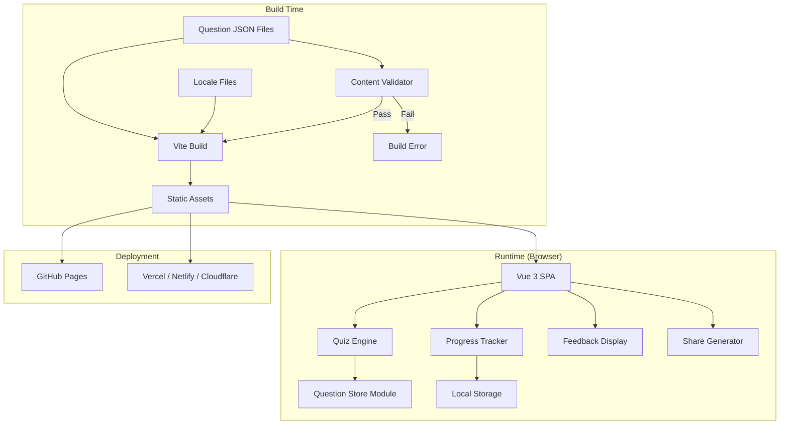
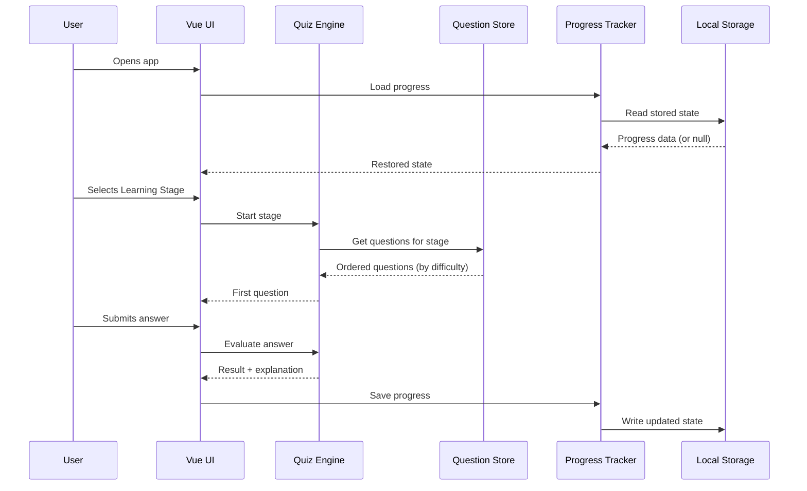
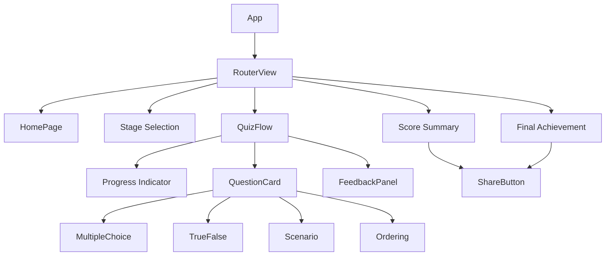
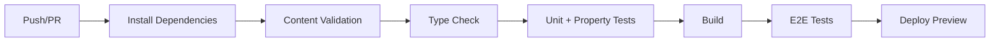

# Design Document: Kiro Quiz Game

## Overview

Kiro Quiz Game is a fully static, client-side quiz application that teaches developers about Kiro concepts through progressive learning stages. The application is built as a single-page application (SPA) using modern web technologies, bundled at build time with all question data, and deployable to any static hosting platform at zero cost.

### Key Design Decisions

1. **Framework: Vue 3 + TypeScript** — Vue 3 with Composition API and `<script setup>` provides a reactive, component-based architecture ideal for the multiple screens and interactive question types. TypeScript ensures type safety across the question data structures and application logic.

2. **Build Tool: Vite** — Fast build times, first-class Vue support via `@vitejs/plugin-vue`, and produces optimized static assets. Supports base path configuration for GitHub Pages subpath deployment.

3. **Styling: CSS Modules + CSS Custom Properties** — Lightweight, no runtime CSS-in-JS overhead, responsive design via media queries, and theme tokens via custom properties for future theming/dark mode.

4. **Data Format: JSON** — Question files stored as JSON for direct import at build time without transformation. JSON produces meaningful Git diffs and is editable in any text editor.

5. **State Management: Pinia** — Official Vue state management library. Provides type-safe stores with devtools support, SSR-ready architecture, and a simple API that integrates naturally with the Composition API.

6. **Routing: Vue Router (hash mode)** — Works on all static hosts including GitHub Pages subpaths without server-side rewrites. Vue Router's hash mode (`createWebHashHistory`) handles client-side navigation reliably.

7. **Testing: Vitest + fast-check** — Vitest for unit/integration tests, fast-check for property-based testing of data validation and quiz logic.

8. **Content Validation: Node.js CLI script** — Runs at build time and in CI. Validates all question JSON files against the schema.

### Non-Goals for MVP

- Server-side rendering or API endpoints
- User authentication or accounts
- Answer obfuscation or encryption
- Real-time multiplayer or leaderboards
- Offline-first (service worker) support

## Architecture



### Data Flow



## Components and Interfaces

### Core Modules

#### 1. Question Store (`src/data/`)

Responsible for loading and providing access to question data bundled at build time.

```typescript
// src/data/types.ts
type DifficultyLevel = 'iniciante' | 'intermediário' | 'avançado';
type QuestionType = 'multiple-choice' | 'true-false' | 'scenario' | 'ordering';
type ReviewStatus = 'reviewed' | 'needs-review' | 'draft';
type Locale = 'pt-BR' | string;

interface QuestionPresentation {
  id: string;
  category: string;
  difficulty: DifficultyLevel;
  type: QuestionType;
  text: string; // max 500 chars
  options: AnswerOption[] | OrderingItem[];
  explanation: string; // max 1000 chars
  sourceUrl: string;
  reviewStatus: ReviewStatus;
  lastReviewedDate: string; // ISO 8601
  locale: Locale;
  stage: LearningStage;
}

interface AnswerOption {
  id: string;
  label: string;
}

interface OrderingItem {
  id: string;
  label: string;
  correctPosition: number; // stored in answer data, not here
}

// Separate answer data (Requirement 12.4)
interface AnswerKey {
  questionId: string;
  correctAnswerId: string; // or correctOrder: string[] for ordering
}
```

```typescript
// src/data/questionStore.ts
interface QuestionStore {
  getStages(): LearningStage[];
  getQuestionsForStage(stage: LearningStage): QuestionPresentation[];
  getQuestionById(id: string): QuestionPresentation | undefined;
  getAnswerKey(questionId: string): AnswerKey;
}
```

#### 2. Quiz Engine (`src/engine/`)

Manages quiz flow, question ordering, answer evaluation, and stage progression.

```typescript
// src/engine/types.ts
type LearningStage =
  | 'kiro-basics'
  | 'specs'
  | 'feature-specs'
  | 'bugfix-specs'
  | 'steering'
  | 'hooks'
  | 'mcp'
  | 'powers'
  | 'skills'
  | 'real-world-workflows'
  | 'enterprise-scenarios';

interface QuizState {
  currentStage: LearningStage;
  currentQuestionIndex: number;
  answers: Record<string, UserAnswer>;
  stageResults: Record<LearningStage, StageResult>;
  completedStages: LearningStage[];
  sessionSeed: number; // for consistent randomization per session
}

interface UserAnswer {
  questionId: string;
  selectedOptionId: string | string[]; // string[] for ordering
  isCorrect: boolean;
  answeredAt: number; // timestamp
}

interface StageResult {
  stage: LearningStage;
  correctCount: number;
  totalCount: number;
  completedAt: number;
}
```

```typescript
// src/engine/quizEngine.ts
interface QuizEngine {
  startStage(stage: LearningStage): QuestionPresentation;
  submitAnswer(questionId: string, answer: string | string[]): AnswerResult;
  nextQuestion(): QuestionPresentation | StageComplete;
  getProgress(): QuizProgress;
  calculatePerformanceLevel(scorePercentage: number): PerformanceLevel;
}

interface AnswerResult {
  isCorrect: boolean;
  correctAnswerId: string | string[];
  explanation: string;
  sourceUrl: string;
}

type PerformanceLevel =
  | 'Iniciante em Kiro'    // 0-49%
  | 'Praticante de Kiro'   // 50-74%
  | 'Especialista em Kiro' // 75-89%
  | 'Mestre em Kiro';      // 90-100%
```

#### 3. Progress Tracker (`src/progress/`)

Handles persistence of user progress to local storage.

```typescript
// src/progress/progressTracker.ts
interface ProgressTracker {
  load(): ProgressState | null;
  save(state: ProgressState): void;
  isAvailable(): boolean;
  reset(): void;
}

interface ProgressState {
  version: number; // schema version for migration
  completedStages: LearningStage[];
  currentStage: LearningStage;
  currentQuestionIndex: number;
  questionsAnswered: number;
  correctAnswerCount: number;
  totalScore: number;
  stageResults: Record<string, StageResult>;
  lastUpdated: number; // timestamp
}
```

#### 4. Share Generator (`src/sharing/`)

Generates share text and handles LinkedIn sharing.

```typescript
// src/sharing/shareGenerator.ts
interface ShareGenerator {
  generateShareText(result: ShareableResult): string;
  shareToLinkedIn(text: string): boolean;
  copyToClipboard(text: string): Promise<boolean>;
}

interface ShareableResult {
  stageName: string;
  correctCount: number;
  totalCount: number;
  performanceLevel?: PerformanceLevel;
  isFullQuizComplete: boolean;
}
```

#### 5. Content Validator (`scripts/validate-content.ts`)

Build-time Node.js script for validating question files.

```typescript
// scripts/validate-content.ts
interface ValidationError {
  questionId: string;
  filePath: string;
  errorType: ValidationErrorType;
  message: string;
}

type ValidationErrorType =
  | 'missing-source-url'
  | 'duplicate-id'
  | 'invalid-answer-reference'
  | 'missing-explanation'
  | 'missing-locale'
  | 'invalid-difficulty'
  | 'invalid-question-type'
  | 'invalid-option-count';

interface ContentValidator {
  validate(questionFiles: string[]): ValidationError[];
  findQuestionsBySourceUrl(url: string): QuestionReference[];
}
```

#### 6. Locale System (`src/i18n/`)

Manages UI labels and static text content via a composable.

```typescript
// src/i18n/types.ts
interface LocaleMessages {
  [key: string]: string;
}

// src/i18n/useLocale.ts — Vue composable
export function useLocale() {
  const locale: Ref<Locale> = ref('pt-BR');

  function t(key: string): string {
    // Returns translated string, falls back to pt-BR
  }

  return { locale, t };
}
```

### Pinia Stores

The application state is managed through Pinia stores, providing reactive state with full TypeScript support and Vue Devtools integration.

```typescript
// src/stores/quizStore.ts
import { defineStore } from 'pinia';

export const useQuizStore = defineStore('quiz', () => {
  // State
  const currentStage = ref<LearningStage>('kiro-basics');
  const currentQuestionIndex = ref(0);
  const answers = ref<Record<string, UserAnswer>>({});
  const stageResults = ref<Record<string, StageResult>>({});
  const completedStages = ref<LearningStage[]>([]);
  const sessionSeed = ref(Date.now());

  // Getters
  const currentQuestion = computed(() => { /* ... */ });
  const stageProgress = computed(() => { /* ... */ });
  const overallScore = computed(() => { /* ... */ });

  // Actions
  function startStage(stage: LearningStage) { /* ... */ }
  function submitAnswer(questionId: string, answer: string | string[]) { /* ... */ }
  function nextQuestion() { /* ... */ }

  return {
    currentStage, currentQuestionIndex, answers,
    stageResults, completedStages, sessionSeed,
    currentQuestion, stageProgress, overallScore,
    startStage, submitAnswer, nextQuestion,
  };
});
```

```typescript
// src/stores/progressStore.ts
import { defineStore } from 'pinia';

export const useProgressStore = defineStore('progress', () => {
  const isStorageAvailable = ref(true);
  const hasRecoveryError = ref(false);

  function load(): ProgressState | null { /* ... */ }
  function save(state: ProgressState): void { /* ... */ }
  function reset(): void { /* ... */ }

  return { isStorageAvailable, hasRecoveryError, load, save, reset };
});
```

### Vue Router Configuration

```typescript
// src/router/index.ts
import { createRouter, createWebHashHistory } from 'vue-router';

const routes = [
  { path: '/', name: 'home', component: () => import('@/views/HomePage.vue') },
  { path: '/stages', name: 'stages', component: () => import('@/views/StageSelect.vue') },
  { path: '/quiz/:stage', name: 'quiz', component: () => import('@/views/QuizFlow.vue') },
  { path: '/summary/:stage', name: 'summary', component: () => import('@/views/StageSummary.vue') },
  { path: '/achievement', name: 'achievement', component: () => import('@/views/FinalAchievement.vue') },
];

export const router = createRouter({
  history: createWebHashHistory(),
  routes,
});
```

### UI Components



### Component Structure (Vue SFC with `<script setup>`)

```vue
<!-- src/views/QuizFlow.vue -->
<script setup lang="ts">
import { useRoute } from 'vue-router';
import { useQuizStore } from '@/stores/quizStore';
import { useProgressStore } from '@/stores/progressStore';
import ProgressBar from '@/components/ProgressBar.vue';
import QuestionCard from '@/components/QuestionCard.vue';
import FeedbackPanel from '@/components/FeedbackPanel.vue';

const route = useRoute();
const quizStore = useQuizStore();
const progressStore = useProgressStore();

const stage = computed(() => route.params.stage as LearningStage);

onMounted(() => {
  quizStore.startStage(stage.value);
});

function handleSubmit(answer: string | string[]) {
  const result = quizStore.submitAnswer(
    quizStore.currentQuestion!.id,
    answer
  );
  progressStore.save(quizStore.$state);
}
</script>

<template>
  <div :class="$style.quizFlow">
    <ProgressBar
      :current="quizStore.currentQuestionIndex + 1"
      :total="quizStore.stageProgress.total"
    />
    <QuestionCard
      v-if="quizStore.currentQuestion"
      :question="quizStore.currentQuestion"
      @submit="handleSubmit"
    />
    <FeedbackPanel
      v-if="quizStore.lastResult"
      :result="quizStore.lastResult"
      @next="quizStore.nextQuestion()"
    />
  </div>
</template>

<style module>
.quizFlow {
  max-width: 800px;
  margin: 0 auto;
  padding: var(--spacing-lg);
}
</style>
```

### Screen Flow

| Screen | Route | Description |
|--------|-------|-------------|
| Home | `#/` | Welcome screen with start button |
| Stage Selection | `#/stages` | Grid of Learning Stages with completion status |
| Quiz Flow | `#/quiz/:stage` | Active quiz with question, options, progress |
| Stage Summary | `#/summary/:stage` | Score for completed stage + share button |
| Final Achievement | `#/achievement` | Overall score, performance level, share |

## Data Models

### Question File Structure

Questions are stored in `content/questions/{locale}/{stage}.json`:

```
content/
├── questions/
│   └── pt-BR/
│       ├── kiro-basics.json
│       ├── specs.json
│       ├── feature-specs.json
│       ├── bugfix-specs.json
│       ├── steering.json
│       ├── hooks.json
│       ├── mcp.json
│       ├── powers.json
│       ├── skills.json
│       ├── real-world-workflows.json
│       └── enterprise-scenarios.json
├── answers/
│   └── pt-BR/
│       ├── kiro-basics.answers.json
│       ├── specs.answers.json
│       └── ... (one per stage)
└── i18n/
    └── pt-BR/
        └── ui.json
```

### Question JSON Schema (per stage file)

```json
{
  "stage": "kiro-basics",
  "locale": "pt-BR",
  "questions": [
    {
      "id": "kb-001",
      "category": "Conceitos Fundamentais",
      "difficulty": "iniciante",
      "type": "multiple-choice",
      "text": "O que é o Kiro?",
      "options": [
        { "id": "a", "label": "Um IDE baseado em IA..." },
        { "id": "b", "label": "Um framework de testes..." },
        { "id": "c", "label": "Um banco de dados..." },
        { "id": "d", "label": "Um sistema operacional..." }
      ],
      "explanation": "Kiro é um ambiente de desenvolvimento...",
      "sourceUrl": "https://kiro.dev/docs/overview",
      "reviewStatus": "reviewed",
      "lastReviewedDate": "2025-01-15"
    }
  ]
}
```

### Answer File Schema (separate from presentation)

```json
{
  "stage": "kiro-basics",
  "answers": [
    { "questionId": "kb-001", "correctAnswerId": "a" },
    { "questionId": "kb-005", "correctOrder": ["step-3", "step-1", "step-4", "step-2"] }
  ]
}
```

### Progress State (Local Storage)

```json
{
  "version": 1,
  "completedStages": ["kiro-basics", "specs"],
  "currentStage": "feature-specs",
  "currentQuestionIndex": 3,
  "questionsAnswered": 25,
  "correctAnswerCount": 20,
  "totalScore": 80,
  "stageResults": {
    "kiro-basics": { "correctCount": 8, "totalCount": 10, "completedAt": 1706000000 },
    "specs": { "correctCount": 12, "totalCount": 15, "completedAt": 1706100000 }
  },
  "lastUpdated": 1706200000
}
```

### UI Locale File (`content/i18n/pt-BR/ui.json`)

```json
{
  "app.title": "Kiro Quiz Game",
  "home.welcome": "Teste seus conhecimentos sobre Kiro!",
  "home.start": "Começar",
  "stage.select": "Escolha um Estágio",
  "quiz.progress": "{current} / {total}",
  "quiz.submit": "Confirmar Resposta",
  "quiz.next": "Próxima Pergunta",
  "feedback.correct": "Correto!",
  "feedback.incorrect": "Incorreto",
  "feedback.source": "Saiba mais na documentação oficial",
  "summary.title": "Resultado do Estágio",
  "summary.score": "Você acertou {correct} de {total}",
  "share.button": "Compartilhar no LinkedIn",
  "share.copied": "Texto copiado!",
  "achievement.title": "Parabéns!",
  "progress.unavailable": "Progresso não será salvo nesta sessão",
  "progress.corrupted": "Progresso anterior não pôde ser recuperado"
}
```

## Correctness Properties

*A property is a characteristic or behavior that should hold true across all valid executions of a system — essentially, a formal statement about what the system should do. Properties serve as the bridge between human-readable specifications and machine-verifiable correctness guarantees.*

### Property 1: Question schema validity

*For any* question loaded from the Question Store, it must contain all required fields with valid types and constraints: non-empty id, text ≤ 500 characters, explanation ≤ 1000 characters, valid difficulty level, valid question type, non-empty sourceUrl, valid ISO 8601 date for lastReviewedDate, valid locale, and the correct number of options for its question type (multiple-choice: 3-5, true-false: 2, scenario: 3-5, ordering: 3-7).

**Validates: Requirements 1.1, 1.2, 13.3**

### Property 2: Content validator detects missing required text fields

*For any* question where the sourceUrl field is absent, empty, or whitespace-only, OR where the explanation field is absent, empty, or whitespace-only, OR where the locale field is absent, the Content Validator must report a validation error identifying that question.

**Validates: Requirements 2.1, 2.4, 2.5**

### Property 3: Content validator detects invalid enum values

*For any* question with a difficulty value not in {iniciante, intermediário, avançado} OR a type value not in {multiple-choice, true-false, scenario, ordering}, the Content Validator must report a validation error identifying that question.

**Validates: Requirements 2.6, 2.8**

### Property 4: Content validator detects duplicate IDs

*For any* set of question files containing two or more questions with the same id, the Content Validator must report a validation error for each duplicate occurrence.

**Validates: Requirements 2.2**

### Property 5: Content validator detects invalid answer references

*For any* question where the correctAnswerId does not match any option id in that question's options array (or for ordering questions, where correctOrder contains ids not present in the items), the Content Validator must report a validation error.

**Validates: Requirements 2.3**

### Property 6: Content validator error output format

*For any* validation error detected by the Content Validator, the error output must include the affected question's identifier and the file path where the error was found.

**Validates: Requirements 2.7**

### Property 7: Difficulty ordering within stage

*For any* Learning Stage, the questions returned by the Quiz Engine must be ordered such that all "iniciante" questions appear before all "intermediário" questions, which appear before all "avançado" questions.

**Validates: Requirements 3.2**

### Property 8: Stage completion progression

*For any* non-final Learning Stage, after a user has submitted an answer to every question in that stage, the stage must be marked as complete and the next stage in the defined order must become the current stage.

**Validates: Requirements 3.3**

### Property 9: No answer leakage before submission

*For any* question in pre-submission state, the presentation data structure must not contain the correct answer identifier, and the rendered question component must not include the correct answer identifier in its output.

**Validates: Requirements 4.2, 12.4, 12.5**

### Property 10: Ordering question randomization

*For any* ordering question with 3 or more items, the presented order must differ from the correct sequence (verified statistically — the probability of random order matching correct order must be less than 1/n! where n is the item count).

**Validates: Requirements 4.5**

### Property 11: Deterministic randomization per session seed

*For any* question and session seed value, applying the randomization function multiple times must produce the same option order each time.

**Validates: Requirements 4.6**

### Property 12: Progress state round-trip

*For any* valid ProgressState object, serializing it to local storage and then deserializing it must produce an equivalent object with all fields preserved (completedStages, currentStage, currentQuestionIndex, questionsAnswered, correctAnswerCount, totalScore, stageResults).

**Validates: Requirements 6.2, 6.4**

### Property 13: Corrupted progress recovery

*For any* string stored in the progress local storage key that is not valid JSON or does not conform to the ProgressState schema, the Progress Tracker must return a fresh initial state without throwing an exception.

**Validates: Requirements 6.7**

### Property 14: Score formatting

*For any* stage result with a correctCount and totalCount where 0 ≤ correctCount ≤ totalCount, the formatted score string must equal "{correctCount}/{totalCount}".

**Validates: Requirements 7.1**

### Property 15: Performance level classification

*For any* score percentage from 0 to 100, the assigned performance level must be: "Iniciante em Kiro" for 0-49%, "Praticante de Kiro" for 50-74%, "Especialista em Kiro" for 75-89%, and "Mestre em Kiro" for 90-100%.

**Validates: Requirements 7.4**

### Property 16: Share text generation

*For any* valid ShareableResult (with any stage name and score values), the generated share text must: contain the score in "X/Y" format, contain the stage name, be at most 280 characters in length, and contain only the score, stage name, performance level, and static template text (no personally identifiable information).

**Validates: Requirements 8.2, 8.4**

### Property 17: Progress indicator formatting

*For any* current question index (1-based) and total question count where 1 ≤ current ≤ total, the progress indicator must display "{current} / {total}".

**Validates: Requirements 9.3**

### Property 18: Locale fallback to pt-BR

*For any* locale key that exists in the pt-BR locale file but is missing from the active locale file, the locale system must return the pt-BR value for that key.

**Validates: Requirements 10.5**

### Property 19: Source URL lookup and status update

*For any* source URL present in the question store, the findQuestionsBySourceUrl function must return exactly the set of questions whose sourceUrl matches. After marking those questions for review, all must have reviewStatus set to "needs-review".

**Validates: Requirements 13.4, 13.5**

### Property 20: Default review status assignment

*For any* question added to the Question Store without an explicit reviewStatus field, the system must assign the default value "draft".

**Validates: Requirements 13.6, 14.4**

## Error Handling

### Client-Side Error Scenarios

| Scenario | Handling Strategy |
|----------|-------------------|
| Local storage unavailable | Detect via try/catch on `localStorage.setItem`. Show notification banner. Allow play without persistence. |
| Corrupted progress data | Catch JSON parse errors or schema validation failures. Reset to initial state. Show recovery notification. |
| Missing question data for stage | Show error screen with option to return to stage selection. Log error to console. |
| Share URL fails to open | Catch `window.open` failure. Fall back to clipboard copy with user notification. |
| Clipboard API unavailable | Show share text in a selectable text field for manual copy. |
| Missing locale key | Return pt-BR fallback value. Log warning to console in development mode. |

### Build-Time Error Scenarios

| Scenario | Handling Strategy |
|----------|-------------------|
| Content validation failure | Exit with non-zero code. Print all errors with question IDs and file paths. Block deployment. |
| Missing question files | Validator reports missing expected stage files. Build fails. |
| Invalid JSON syntax | JSON parse error caught and reported with file path. Build fails. |

### Error Notification UX

- Notifications appear as a dismissible banner at the top of the viewport
- Non-blocking: user can continue interacting with the app
- Auto-dismiss after 8 seconds for informational messages
- Persist until dismissed for data-loss warnings (corrupted progress)

## Testing Strategy

### Testing Stack

- **Unit & Integration Tests**: Vitest
- **Property-Based Tests**: fast-check (via Vitest)
- **Component Tests**: Vitest + @vue/test-utils
- **E2E Tests**: Playwright (for critical user flows)
- **Content Validation Tests**: Vitest (testing the validator script itself)

### Property-Based Testing Configuration

- Library: **fast-check** (`@fast-check/vitest` integration)
- Minimum iterations: **100 per property**
- Each property test tagged with: `Feature: kiro-quiz-game, Property {number}: {title}`
- Generators will cover edge cases: empty strings, unicode, maximum-length strings, boundary values

### Test Distribution

| Layer | What's Tested | Approach |
|-------|---------------|----------|
| Content Validator | Schema validation, duplicate detection, enum validation | Property-based (Properties 1-6) |
| Quiz Engine | Ordering, progression, randomization, answer evaluation | Property-based (Properties 7-11) |
| Progress Tracker | Serialization round-trip, corruption recovery | Property-based (Properties 12-13) |
| Formatters | Score, progress indicator, performance level | Property-based (Properties 14-17) |
| Locale System | Fallback behavior | Property-based (Property 18) |
| Content Management | URL lookup, status updates, defaults | Property-based (Properties 19-20) |
| UI Components | Rendering, keyboard navigation, responsiveness | Component tests (@vue/test-utils) |
| User Flows | Full quiz completion, sharing, stage navigation | E2E tests (Playwright) |

### Component Testing Approach

Vue components are tested using `@vue/test-utils` with Vitest:

```typescript
// src/components/__tests__/QuestionCard.spec.ts
import { mount } from '@vue/test-utils';
import { createTestingPinia } from '@pinia/testing';
import QuestionCard from '@/components/QuestionCard.vue';

describe('QuestionCard', () => {
  it('renders multiple-choice options', () => {
    const wrapper = mount(QuestionCard, {
      props: { question: mockMultipleChoiceQuestion },
      global: {
        plugins: [createTestingPinia()],
      },
    });
    expect(wrapper.findAll('[role="radio"]')).toHaveLength(4);
  });
});
```

### Unit Test Focus Areas

- Specific rendering of each question type (multiple-choice, true-false, scenario, ordering)
- Screen navigation and routing via Vue Router
- Keyboard accessibility (Tab, Enter, Arrow keys)
- Share button LinkedIn URL construction
- Locale composable loading and fallback behavior
- Stage selection regardless of completion status
- Pinia store actions and getters

### CI Pipeline



### Test Commands

```bash
# Run all tests
npm test

# Run property-based tests only
npm run test:properties

# Run content validation
npm run validate-content

# Run E2E tests
npm run test:e2e

# Type check
npm run typecheck
```
