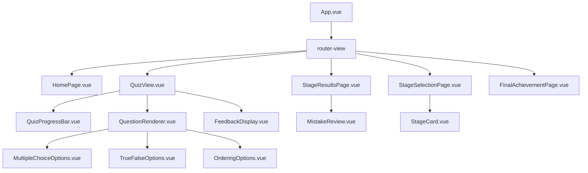
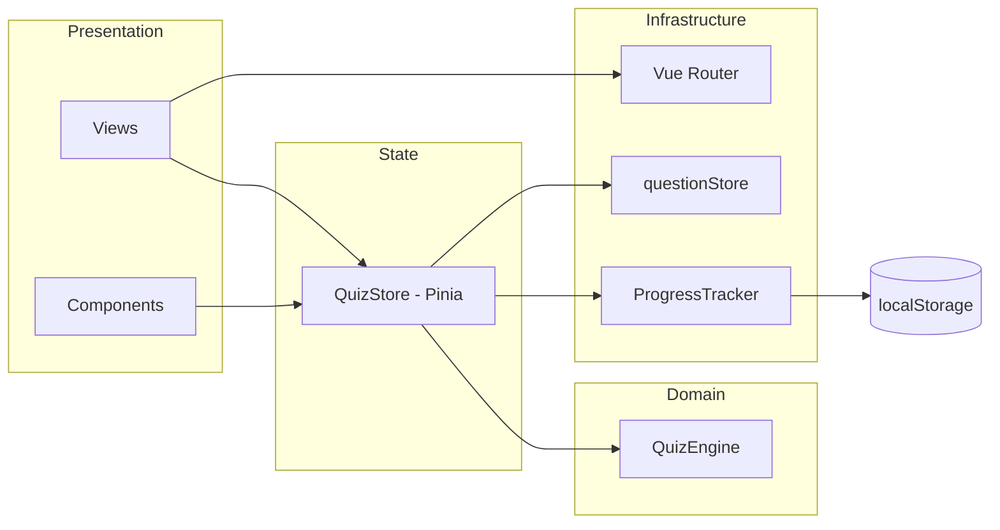
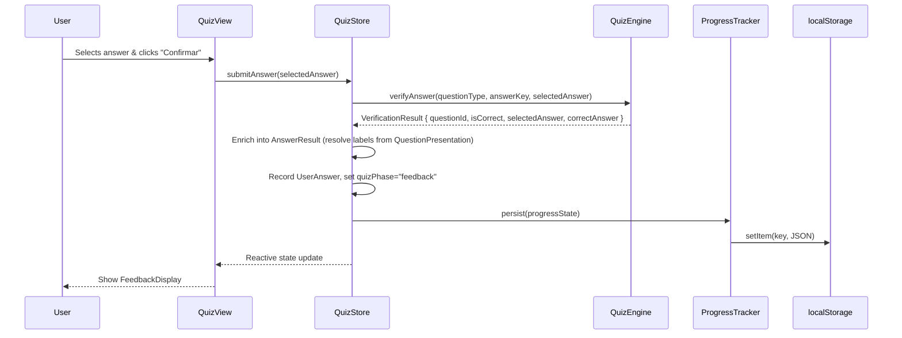

# Design Document: Quiz Gameplay Flow

## Overview

The Quiz Gameplay Flow implements the core interactive learning experience for Kiro Quest. Users progress through 11 learning stages, answering questions of various types (multiple-choice, true-false, scenario, ordering), receiving immediate educational feedback, and tracking their progress across sessions.

The architecture follows a clean separation between:
- **Pure domain logic** (`QuizEngine`) — answer verification, scoring, performance classification
- **Reactive state management** (`QuizStore`) — Pinia store orchestrating UI state, persistence, and navigation
- **Persistence** (`ProgressTracker`) — localStorage read/write with validation
- **Presentation** (Vue components) — views and UI components consuming store state

This design ensures the domain logic is fully testable without Vue/Pinia dependencies, while the store provides a single source of truth for all reactive UI state.

## Architecture

### High-Level Component Tree



### Module Dependency Graph



### Data Flow



## Components and Interfaces

### Views

#### HomePage (`src/views/HomePage.vue`)
- **Props**: None
- **Responsibilities**: Display start/continue/restart actions based on ProgressState existence
- **Store dependencies**: `useQuizStore()` for `hasProgress`, `restoreProgress()`, `resetProgress()`
- **Router actions**: Navigate to `/stages` or `/quiz/:stage`

#### StageSelectionPage (`src/views/StageSelectionPage.vue`)
- **Props**: None
- **Responsibilities**: Display all 11 stages with status indicators, handle stage selection
- **Store dependencies**: `useQuizStore()` for `completedStages`, `currentStage`, `recommendedNextStage`
- **Router actions**: Navigate to `/quiz/:stage`

#### QuizView (`src/views/QuizView.vue`)
- **Props**: Route param `:stage` (LearningStage)
- **Responsibilities**: Orchestrate question display, answer submission, feedback, and navigation
- **Store dependencies**: `useQuizStore()` for `currentQuestion`, `quizPhase`, `submitAnswer()`, `nextQuestion()`, `completeStage()`
- **Router actions**: Navigate to `/summary/:stage` on stage completion
- **Accessibility**: Manages aria-live regions, focus management on phase transitions

#### StageResultsPage (`src/views/StageResultsPage.vue`)
- **Props**: Route param `:stage` (LearningStage)
- **Responsibilities**: Display stage results, navigation actions, mistake review toggle
- **Store dependencies**: `useQuizStore()` for `currentStageResult`, `incorrectAnswers`, `isAllComplete`, `performanceLevel`, `retryStage()`
- **Router actions**: Navigate to `/quiz/:nextStage`, `/stages`, `/`, or `/achievement` when all stages complete

#### FinalAchievementPage (`src/views/FinalAchievementPage.vue`)
- **Props**: None
- **Responsibilities**: Display the final achievement screen when all 11 stages are complete, showing the overall correct answer percentage and the assigned PerformanceLevel
- **Store dependencies**: `useQuizStore()` for `overallPercentage`, `performanceLevel`, `completedStages`, `isAllComplete`
- **Router actions**: Navigate to `/stages` or `/`
- **Guard**: If `isAllComplete` is false, redirect to `/stages`

### UI Components

#### QuizProgressBar (`src/components/QuizProgressBar.vue`)
- **Props**: `current: number`, `total: number`, `stageName: string`, `difficulty: DifficultyLevel`
- **Emits**: None
- **Renders**: Progress indicator "{current} / {total}", stage name, difficulty badge

#### QuestionRenderer (`src/components/QuestionRenderer.vue`)
- **Props**: `question: QuestionPresentation`, `disabled: boolean`
- **Emits**: `select(value: string | string[])`
- **Responsibilities**: Handles answer selection only — delegates to type-specific sub-components, manages ARIA radiogroup. QuestionRenderer does NOT own the submit action; it only emits the selected value upward. The selected answer state is stored in QuizView (local `ref`) while `quizPhase` is `"answering"`. QuizView owns the submit button and calls `QuizStore.submitAnswer()` with the locally held selection.

#### MultipleChoiceOptions (`src/components/MultipleChoiceOptions.vue`)
- **Props**: `options: AnswerOption[]`, `selected: string | null`, `disabled: boolean`
- **Emits**: `select(optionId: string)`
- **Renders**: Radio buttons within ARIA radiogroup

#### TrueFalseOptions (`src/components/TrueFalseOptions.vue`)
- **Props**: `options: AnswerOption[]`, `selected: string | null`, `disabled: boolean`
- **Emits**: `select(optionId: string)`
- **Renders**: Two radio buttons for Verdadeiro/Falso

#### OrderingOptions (`src/components/OrderingOptions.vue`)
- **Props**: `items: OrderingItem[]`, `disabled: boolean`
- **Emits**: `reorder(orderedIds: string[])`
- **Renders**: Sortable list with drag handles and move-up/move-down buttons
- **Accessibility**: Each move button has aria-label with item name and action

#### FeedbackDisplay (`src/components/FeedbackDisplay.vue`)
- **Props**: `result: AnswerResult`, `questionType: QuestionType`
- **Emits**: None
- **Renders**: Success/error indicator, explanation, documentation link (with `target="_blank" rel="noopener noreferrer"`)
- **Accessibility**: `aria-live="assertive"` container, receives focus on mount
- **Note**: All documentation links opened from this component MUST use `target="_blank" rel="noopener noreferrer"`. The `AnswerResult` interface provides all data needed (including `correctAnswerLabel`, `selectedAnswerLabel`, and `correctOrderLabels`) so FeedbackDisplay requires no extra lookup.

#### MistakeReview (`src/components/MistakeReview.vue`)
- **Props**: `mistakes: MistakeItem[]`
- **Emits**: None
- **Renders**: Read-only list of incorrect answers with question text, user answer, correct answer, explanation, source URL
- **Note**: All documentation links opened from this component MUST use `target="_blank" rel="noopener noreferrer"`.

#### StageCard (`src/components/StageCard.vue`)
- **Props**: `stage: LearningStage`, `status: StageStatus`, `isRecommended: boolean`
- **Emits**: `select(stage: LearningStage)`
- **Renders**: Stage name, status indicator, recommended highlight

### Supporting Types

```typescript
// src/components/types.ts
export type StageStatus = 'completed' | 'in-progress' | 'not-started';

export interface MistakeItem {
  questionText: string;
  userAnswerLabel: string;
  correctAnswerLabel: string;
  explanation: string;
  sourceUrl?: string;
}
```

## Data Models

### QuizStore State (Pinia)

```typescript
// src/stores/quizStore.ts
interface QuizStoreState {
  currentStage: LearningStage;
  currentQuestionIndex: number;
  quizPhase: QuizPhase;
  questions: QuestionPresentation[];       // Currently loaded stage questions (see note below)
  completedStages: LearningStage[];
  stageResults: Record<string, StageResult>;
  userAnswersByStage: Record<string, UserAnswer[]>;
  lastAnswerResult: AnswerResult | null;   // For feedback display
  errorMessage: string | null;
}

// Computed/derived getters (NOT stored state):
// - questionsAnswered: derived from sum of all userAnswersByStage arrays' lengths
// - correctAnswerCount: derived from sum of all userAnswersByStage entries where isCorrect === true
// - totalScore: derived from correctAnswerCount (or a weighted formula if needed)
//
// These MUST be recalculated after retrying a stage or restoring progress.
// If persisted in ProgressState for performance, they are treated as a cache
// and MUST be recomputed from userAnswersByStage/stageResults on restore.

type QuizPhase = 'answering' | 'feedback' | 'stage-complete';
```

> **Note:** `QuizStore.questions` contains only the currently loaded stage questions (loaded when a stage is started). The full question catalog source of truth remains the `questionStore` module (`src/data/questionStore.ts`). When a new stage is started, questions are fetched from `questionStore` and sorted by difficulty into this array.

### VerificationResult (returned by QuizEngine.verifyAnswer)

```typescript
// src/engine/types.ts
interface VerificationResult {
  questionId: string;
  isCorrect: boolean;
  selectedAnswer: string | string[];
  correctAnswer: string | string[];
}
```

`QuizEngine.verifyAnswer` returns a minimal `VerificationResult` containing only the pure domain verification outcome. It does NOT resolve labels or include presentation data (explanation, sourceUrl). This keeps QuizEngine free of any dependency on `QuestionPresentation`. The `questionId` is sourced from the `AnswerKey` input (which always includes `questionId`).

### AnswerKey (input to QuizEngine.verifyAnswer)

```typescript
// src/data/types.ts
interface AnswerKey {
  questionId: string;
  correctAnswerId?: string;
  correctOrder?: string[];
}
```

The `AnswerKey` interface explicitly includes `questionId`, enabling `QuizEngine.verifyAnswer` to populate `VerificationResult.questionId` without requiring access to `QuestionPresentation`. For multiple-choice/true-false/scenario questions, `correctAnswerId` is set. For ordering questions, `correctOrder` is set. Exactly one of these fields is present per answer key.

### AnswerResult (enriched by QuizStore)

```typescript
// src/engine/types.ts
interface AnswerResult {
  questionId: string;
  isCorrect: boolean;
  selectedAnswer: string | string[];
  correctAnswer: string | string[];
  selectedAnswerLabel?: string;
  correctAnswerLabel?: string;
  correctOrderLabels?: string[];
  explanation: string;
  sourceUrl?: string;
}
```

`AnswerResult` is the enriched version of `VerificationResult`, constructed by the **QuizStore** after receiving the verification outcome. The QuizStore resolves IDs to human-readable labels using `QuestionPresentation` and attaches `explanation` and `sourceUrl` from the question data. This ensures `FeedbackDisplay` has all data needed to render feedback without performing any extra lookup.

**Enrichment flow:**
1. QuizEngine returns `VerificationResult` (pure domain)
2. QuizStore enriches it into `AnswerResult` using `QuestionPresentation` fields (labels, explanation, sourceUrl)
3. QuizStore stores the `AnswerResult` as `lastAnswerResult` for the UI layer

### ProgressState (Persisted to localStorage)

```typescript
// Extended from src/progress/types.ts
interface ProgressState {
  version: number;
  currentStage: LearningStage;
  currentQuestionIndex: number;
  quizPhase: QuizPhase;
  completedStages: LearningStage[];
  stageResults: Record<string, StageResult>;
  userAnswersByStage: Record<string, UserAnswer[]>;
  lastUpdated: number;  // Unix timestamp ms
}
```

> **Derived fields not persisted:** `questionsAnswered`, `correctAnswerCount`, `totalScore`, and `overallPercentage` are NOT stored in `ProgressState`. They are always derived from `userAnswersByStage` and `stageResults` on restore. This avoids stale cached values after retrying a stage or partial progress changes.

### Feedback Restore Behavior

When `quizPhase` is `"feedback"` after a page reload, the `lastAnswerResult` is NOT persisted in `ProgressState`. Instead, the QuizStore **reconstructs** it on restore:

1. Read the last `UserAnswer` for the current stage/question from `userAnswersByStage`
2. Load the `QuestionPresentation` from `questionStore.getQuestionById(questionId)`
3. Load the `AnswerKey` from `questionStore.getAnswerKey(questionId)`
4. Rebuild the `AnswerResult` by resolving labels from the question data

This avoids duplicating derived data in persistence and ensures feedback is always consistent with the current question catalog.

### QuizEngine Interface

```typescript
// src/engine/quizEngine.ts — pure functions, no framework dependencies
export interface QuizEngineAPI {
  /**
   * Verifies an answer against the answer key.
   * Returns a minimal VerificationResult (no labels, no explanation).
   * The QuizStore is responsible for enriching this into a full AnswerResult.
   */
  verifyAnswer(
    questionType: QuestionType,
    answerKey: AnswerKey,
    selectedAnswer: string | string[]
  ): VerificationResult;

  calculateStageResult(
    stage: LearningStage,
    answers: UserAnswer[]
  ): StageResult;

  /**
   * Assigns a PerformanceLevel based on the given percentage.
   * Always returns a PerformanceLevel for valid inputs (0-100%).
   * Callers must check canShowFinalPerformance() before displaying.
   */
  calculatePerformanceLevel(
    correctCount: number,
    totalCount: number
  ): PerformanceLevel;

  /**
   * Returns true only when all 11 stages are completed.
   * Use this guard before calling calculatePerformanceLevel for final display.
   */
  canShowFinalPerformance(
    completedStages: LearningStage[]
  ): boolean;

  calculatePercentage(
    correctCount: number,
    totalCount: number
  ): number;

  /**
   * Returns the next stage in the official order regardless of completion status.
   * Returns null if currentStage is the last stage (enterprise-scenarios).
   */
  getNextStageInOrder(
    currentStage: LearningStage
  ): LearningStage | null;

  /**
   * Returns the first incomplete stage in the official order.
   * Returns null if all stages are completed.
   */
  getRecommendedNextStage(
    completedStages: LearningStage[]
  ): LearningStage | null;
}
```

### ProgressTracker Interface

```typescript
// src/progress/progressTracker.ts
export interface ProgressTrackerAPI {
  persist(state: ProgressState): void;
  restore(): ProgressState | null;
  clear(): void;
  isValid(data: unknown): data is ProgressState;
}
```

### Router Configuration

```typescript
// Added to src/main.ts routes
const routes = [
  { path: '/', name: 'home', component: () => import('@/views/HomePage.vue') },
  { path: '/stages', name: 'stages', component: () => import('@/views/StageSelectionPage.vue') },
  { path: '/quiz/:stage', name: 'quiz', component: () => import('@/views/QuizView.vue') },
  { path: '/summary/:stage', name: 'summary', component: () => import('@/views/StageResultsPage.vue') },
  { path: '/achievement', name: 'achievement', component: () => import('@/views/FinalAchievementPage.vue') },
  { path: '/:pathMatch(.*)*', redirect: '/stages' },
];
```

Route guards validate the `:stage` parameter against the known `LearningStage` union. Invalid stages redirect to `/stages`. The `/achievement` route is guarded: if `isAllComplete` is false, the guard redirects to `/stages`.

### Navigation Guards and Constraints

1. **Invalid stage parameter**: A `beforeEach` guard validates `:stage` params against the `LearningStage` union. Invalid params redirect to `/stages`.

2. **Achievement page guard**: The `/achievement` route checks `QuizStore.isAllComplete`. If false, redirects to `/stages`.

3. **No duplicate submissions via browser history**: Browser back/forward navigation MUST NOT allow an already answered question to be submitted again unless the user explicitly retries the stage. The QuizView checks `userAnswersByStage` on mount/route-change: if the current question already has a recorded answer and `quizPhase` should be `"feedback"`, the view restores the feedback state rather than presenting the question for re-submission. The submit button is disabled when an answer already exists for the current question.

4. **Stage results guard**: Navigating to `/summary/:stage` for a stage that is not in `completedStages` and whose `quizPhase` is not `"stage-complete"` redirects to `/quiz/:stage` or `/stages`.

### localStorage Key

```
kiro-quest:progress:v1
```

The key includes a version segment so that schema migrations can be handled by checking the `version` field in the stored JSON.

## Correctness Properties

*A property is a characteristic or behavior that should hold true across all valid executions of a system — essentially, a formal statement about what the system should do. Properties serve as the bridge between human-readable specifications and machine-verifiable correctness guarantees.*

### Property 1: Answer verification correctness

*For any* question (of any type) with a known AnswerKey, the QuizEngine `verifyAnswer` function SHALL return `isCorrect: true` if and only if the user's selection exactly matches the correct answer. For multiple-choice/true-false/scenario types, this means the selected option ID equals `correctAnswerId`. For ordering types, this means the user's ordered array is identical in sequence to the `correctOrder` array.

**Validates: Requirements 4.1, 4.2, 4.3, 4.4**

### Property 2: Progress state round-trip (serialization)

*For any* valid ProgressState object, persisting it via ProgressTracker and then restoring it SHALL produce an object deeply equal to the original, with all fields preserved (version, currentStage, currentQuestionIndex, quizPhase, completedStages, stageResults, userAnswersByStage, lastUpdated). Derived values (questionsAnswered, correctAnswerCount, totalScore, overallPercentage) are recomputed from `userAnswersByStage` and `stageResults` after restore and are NOT part of the round-trip contract.

**Validates: Requirements 7.5, 7.6, 7.7, 11.1, 11.2, 11.4**

### Property 3: Performance level classification

*For any* percentage value between 0 and 100 (inclusive), the QuizEngine `calculatePerformanceLevel` function SHALL assign exactly one PerformanceLevel according to the defined ranges: 0–49% → "Iniciante em Kiro", 50–74% → "Praticante de Kiro", 75–89% → "Especialista em Kiro", 90–100% → "Mestre em Kiro".

**Validates: Requirements 12.3, 12.4, 12.5, 12.6**

### Property 4: Percentage calculation precision

*For any* pair of non-negative integers (correctCount, totalCount) where totalCount > 0 and correctCount ≤ totalCount, the QuizEngine `calculatePercentage` function SHALL return a value equal to `Math.trunc((correctCount / totalCount) * 1000) / 10` (truncated to one decimal place), and the result SHALL be between 0.0 and 100.0 inclusive.

**Validates: Requirements 12.1**

### Property 5: Performance level guard

*For any* set of completedStages with length less than 11, the QuizEngine `canShowFinalPerformance` function SHALL return false. *For any* set of completedStages containing all 11 stages, `canShowFinalPerformance` SHALL return true. The application SHALL NOT display a final PerformanceLevel unless `canShowFinalPerformance` returns true.

**Validates: Requirements 12.7**

### Property 6: Recommended next stage

*For any* subset of completedStages (from the 11 defined stages), the `getRecommendedNextStage` function SHALL return the first stage in the defined order that is NOT in completedStages, or null if all stages are completed. Separately, `getNextStageInOrder(currentStage)` SHALL return the stage immediately following `currentStage` in the defined order, or null if `currentStage` is the last stage (enterprise-scenarios), regardless of completion status.

**Validates: Requirements 2.4, 8.2, 10.5**

### Property 7: Stage status classification

*For any* combination of completedStages and currentStage, each of the 11 stages SHALL be classified as exactly one of: "completed" (if in completedStages), "in-progress" (if equals currentStage and not in completedStages), or "not-started" (otherwise).

**Validates: Requirements 2.3, 10.4**

### Property 8: Stage completion records result

*For any* stage with a non-empty array of UserAnswer objects, completing the stage SHALL produce a StageResult where `correctCount` equals the number of UserAnswers with `isCorrect: true`, `totalCount` equals the total number of UserAnswers, and the stage SHALL be added to completedStages.

**Validates: Requirements 6.4, 10.2**

### Property 9: Submit answer transitions phase

*For any* valid answer submission (regardless of question type or correctness), the quizPhase SHALL transition from "answering" to "feedback".

**Validates: Requirements 4.8, 7.3**

### Property 10: Advance question increments index

*For any* currentQuestionIndex that is less than (totalQuestions - 1), calling the advance action SHALL increment currentQuestionIndex by exactly 1 and set quizPhase to "answering".

**Validates: Requirements 6.3**

### Property 11: Starting a stage produces sorted questions

*For any* LearningStage that has questions in the questionStore, starting that stage SHALL set currentQuestionIndex to 0, quizPhase to "answering", and the loaded questions SHALL be sorted by difficulty in the order: iniciante → intermediário → avançado.

**Validates: Requirements 13.5**

### Property 12: Retry stage clears and recalculates

*For any* completed stage with recorded answers, retrying that stage SHALL remove it from completedStages, clear its UserAnswer entries from userAnswersByStage, remove its StageResult, and reset currentQuestionIndex to 0 with quizPhase "answering". After retrying, the derived `totalScore` and `correctAnswerCount` MUST reflect the remaining answers (excluding the retried stage's cleared entries).

**Validates: Requirements 8.4**

### Property 13: Mistake review contains exactly incorrect answers

*For any* set of UserAnswer objects for a completed stage, the mistake review list SHALL contain exactly those answers where `isCorrect` is false, and SHALL NOT contain any answers where `isCorrect` is true.

**Validates: Requirements 9.2**

### Property 14: Invalid progress data yields fresh state

*For any* value stored in localStorage that is not valid JSON, or is valid JSON but does not conform to the ProgressState schema (missing required fields, wrong types, or mismatched version), the ProgressTracker `restore` function SHALL return null.

**Validates: Requirements 11.3, 11.6**

### Property 15: Invalid route stage parameter redirects

*For any* string that is not one of the 11 valid LearningStage identifiers, navigating to `/quiz/:stage` or `/summary/:stage` with that string SHALL result in a redirect to `/stages`.

**Validates: Requirements 17.3**

## Error Handling

### Question Loading Failures
- If `questionStore.getQuestionsForStage(stage)` returns an empty array, the QuizStore sets `errorMessage` and does not modify `currentStage` or `currentQuestionIndex`.
- The QuizView displays the error message with a "Voltar aos Estágios" link.

### Answer Key Not Found
- If `questionStore.getAnswerKey(questionId)` throws, the QuizStore catches the error, sets `errorMessage`, and does NOT record a UserAnswer or transition quizPhase.
- The QuizView displays an error notification indicating the question cannot be verified.

### localStorage Unavailable
- The ProgressTracker wraps all localStorage calls in try/catch.
- On write failure: logs a warning, continues without persistence. The user can still play but progress won't survive page reload.
- On read failure: returns null, triggering fresh state initialization with a user notification.

### Invalid Route Parameters
- A navigation guard (`beforeEach`) validates `:stage` params against the `LearningStage` union.
- Invalid params redirect to `/stages` with no error message (silent redirect).

### Schema Version Mismatch
- On restore, if `stored.version !== CURRENT_VERSION`, the ProgressTracker returns null and the application starts fresh with a notification explaining the reset.

## Testing Strategy

### Property-Based Tests (fast-check + vitest)

The project uses `fast-check` with `@fast-check/vitest` for property-based testing. Each correctness property maps to one property-based test with a minimum of 100 iterations.

**Library**: `fast-check` (already installed)
**Runner**: `vitest` with `@fast-check/vitest` integration
**Minimum iterations**: 100 per property test
**Tag format**: `Feature: quiz-gameplay-flow, Property {N}: {title}`

Property tests target the pure domain logic layer:
- `src/engine/quizEngine.ts` — Properties 1, 3, 4, 5, 6, 7, 8
- `src/progress/progressTracker.ts` — Properties 2, 14
- `src/stores/quizStore.ts` — Properties 9, 10, 11, 12, 13
- Router guard logic — Property 15

### Unit Tests (vitest)

Example-based unit tests cover:
- Component rendering for each question type
- UI state transitions (button visibility, disabled states)
- Accessibility attributes (ARIA roles, labels, live regions)
- Keyboard navigation
- Edge cases (empty stages, missing answer keys, localStorage unavailable)
- HomePage conditional rendering (start vs continue/restart)
- FeedbackDisplay content for correct/incorrect answers
- Route configuration verification

### Integration Tests

- Full flow: start quiz → answer questions → complete stage → view results
- Progress persistence: answer → reload → verify state restored
- Navigation: back/forward browser history consistency
- Stage retry: complete → retry → verify clean state

### Test File Organization

```
src/
  engine/__tests__/
    quizEngine.test.ts          # Unit tests
    quizEngine.property.test.ts # Property tests (Properties 1, 3, 4, 5, 6, 7, 8)
  progress/__tests__/
    progressTracker.test.ts          # Unit tests
    progressTracker.property.test.ts # Property tests (Properties 2, 14)
  stores/__tests__/
    quizStore.test.ts          # Unit tests
    quizStore.property.test.ts # Property tests (Properties 9, 10, 11, 12, 13)
  views/__tests__/
    HomePage.test.ts
    QuizView.test.ts
    StageSelectionPage.test.ts
    StageResultsPage.test.ts
  components/__tests__/
    QuestionRenderer.test.ts
    FeedbackDisplay.test.ts
    OrderingOptions.test.ts
    MistakeReview.test.ts
  router/__tests__/
    routeGuards.property.test.ts # Property test (Property 15)
```

