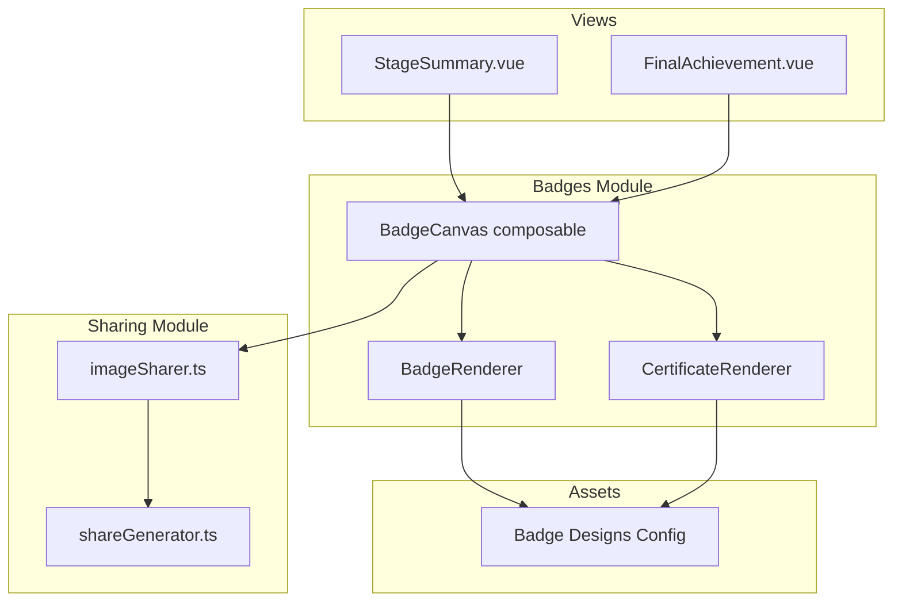
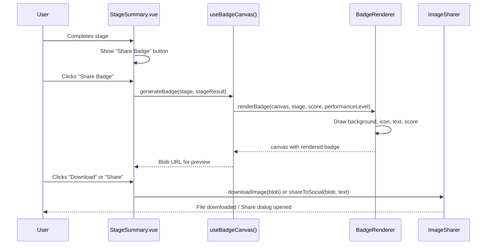
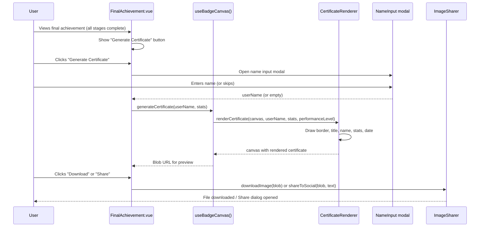

# Design Document: Shareable Badges and Certificate

## Overview

This feature adds client-side image generation for shareable achievement badges and a full completion certificate to the Kiro Quest application. When a user completes a quiz module/stage, they receive a small shareable badge image. When all 11 stages are completed, a full completion certificate is generated. Both artifacts can be downloaded as PNG images and shared directly to LinkedIn and other social networks.

The implementation uses the HTML5 Canvas API for image generation — chosen over SVG-to-canvas or html2canvas because it provides full control over rendering, has zero external dependencies, produces consistent results across browsers, and outputs PNG blobs directly for download/sharing.

## Architecture



## Sequence Diagrams

### Badge Generation Flow (Stage Completion)



### Certificate Generation Flow (Full Completion)



## Components and Interfaces

### Component 1: BadgeRenderer

**Purpose**: Renders a module completion badge onto an HTML5 Canvas element.

**Interface**:
```typescript
interface BadgeRendererOptions {
  stage: LearningStage;
  score: { correct: number; total: number };
  performanceLevel: PerformanceLevel;
  theme: 'light' | 'dark';
}

interface BadgeRenderer {
  render(ctx: CanvasRenderingContext2D, options: BadgeRendererOptions): void;
}
```

**Responsibilities**:
- Draw badge background with stage-specific color gradient
- Draw stage icon/emoji centered
- Draw stage name text
- Draw score (e.g., "8/10")
- Draw performance level label
- Draw "Kiro Quest" branding footer
- Respect theme (light/dark variants)

**Badge Dimensions**: 400×400 pixels (optimized for social media thumbnails)

### Component 2: CertificateRenderer

**Purpose**: Renders a full completion certificate onto an HTML5 Canvas element.

**Interface**:
```typescript
interface CertificateRendererOptions {
  userName: string; // Empty string if user skipped name entry
  stats: {
    totalCorrect: number;
    totalQuestions: number;
    percentage: number;
    completedStages: number;
  };
  performanceLevel: PerformanceLevel;
  completionDate: Date;
  theme: 'light' | 'dark';
}

interface CertificateRenderer {
  render(ctx: CanvasRenderingContext2D, options: CertificateRendererOptions): void;
}
```

**Responsibilities**:
- Draw decorative border (gold/blue gradient)
- Draw "Certificado de Conclusão" title
- Draw "Person X completed the Kiro Quest trail successfully" text (in Portuguese)
- Draw overall score and performance level
- Draw completion date
- Draw "Kiro Quest" branding
- Handle absent user name gracefully (use generic text)

**Certificate Dimensions**: 1200×800 pixels (landscape, optimized for LinkedIn posts)

### Component 3: useBadgeCanvas() Composable

**Purpose**: Vue composable that manages canvas lifecycle, image generation, and blob creation.

**Interface**:
```typescript
interface UseBadgeCanvasReturn {
  canvasRef: Ref<HTMLCanvasElement | null>;
  isGenerating: Ref<boolean>;
  previewUrl: Ref<string | null>;
  error: Ref<string | null>;
  generateBadge: (options: BadgeRendererOptions) => Promise<Blob | null>;
  generateCertificate: (options: CertificateRendererOptions) => Promise<Blob | null>;
  cleanup: () => void;
}

function useBadgeCanvas(): UseBadgeCanvasReturn;
```

**Responsibilities**:
- Create and manage offscreen canvas
- Call appropriate renderer (badge or certificate)
- Convert canvas to PNG Blob
- Create object URLs for image preview
- Manage loading/error states
- Clean up object URLs on unmount

### Component 4: ImageSharer

**Purpose**: Handles downloading and sharing generated images to social platforms.

**Interface**:
```typescript
interface ImageShareOptions {
  blob: Blob;
  fileName: string;
  shareText: string;
  platform: 'linkedin' | 'twitter' | 'generic';
}

interface ImageSharer {
  downloadImage(blob: Blob, fileName: string): void;
  shareToSocial(options: ImageShareOptions): Promise<boolean>;
  canUseWebShareAPI(): boolean;
  shareViaWebAPI(blob: Blob, text: string, fileName: string): Promise<boolean>;
}
```

**Responsibilities**:
- Create download link with blob URL and trigger download
- Open LinkedIn sharing dialog (URL-based share with pre-filled text)
- Open Twitter/X sharing dialog
- Detect and use Web Share API when available (mobile)
- Fall back to clipboard copy + share URL when Web Share API unavailable

### Component 5: NameInputModal.vue

**Purpose**: Optional modal dialog prompting the user for their name before certificate generation.

**Interface**:
```typescript
// Props
interface NameInputModalProps {
  visible: boolean;
}

// Emits
interface NameInputModalEmits {
  (e: 'confirm', name: string): void;
  (e: 'skip'): void;
  (e: 'close'): void;
}
```

**Responsibilities**:
- Display text input for user's name
- Validate name (non-empty if provided, max 60 characters)
- Provide "Skip" button for users who prefer anonymity
- Emit confirmed name or skip event
- Accessible: proper ARIA labels, focus trap, escape to close

### Component 6: ShareBadgeButton.vue

**Purpose**: Reusable button component that triggers badge/certificate generation with share options dropdown.

**Interface**:
```typescript
// Props
interface ShareBadgeButtonProps {
  type: 'badge' | 'certificate';
  stage?: LearningStage; // Required when type='badge'
  label?: string;
}

// Emits
interface ShareBadgeButtonEmits {
  (e: 'generated', blob: Blob): void;
}
```

**Responsibilities**:
- Show generation button with appropriate label
- Display loading state during generation
- Show preview of generated image
- Provide download and share action buttons
- Handle error states gracefully

## Data Models

### Badge Design Configuration

```typescript
interface BadgeDesign {
  stage: LearningStage;
  icon: string;          // Emoji or unicode character
  primaryColor: string;  // Hex color for gradient start
  secondaryColor: string; // Hex color for gradient end
  displayName: string;   // Portuguese stage name
}

const BADGE_DESIGNS: Record<LearningStage, BadgeDesign> = {
  'kiro-basics': {
    stage: 'kiro-basics',
    icon: '🚀',
    primaryColor: '#3b82f6',
    secondaryColor: '#1d4ed8',
    displayName: 'Fundamentos do Kiro',
  },
  'specs': {
    stage: 'specs',
    icon: '📋',
    primaryColor: '#8b5cf6',
    secondaryColor: '#6d28d9',
    displayName: 'Specs',
  },
  'feature-specs': {
    stage: 'feature-specs',
    icon: '✨',
    primaryColor: '#06b6d4',
    secondaryColor: '#0891b2',
    displayName: 'Feature Specs',
  },
  'bugfix-specs': {
    stage: 'bugfix-specs',
    icon: '🐛',
    primaryColor: '#f59e0b',
    secondaryColor: '#d97706',
    displayName: 'Bugfix Specs',
  },
  'steering': {
    stage: 'steering',
    icon: '🧭',
    primaryColor: '#10b981',
    secondaryColor: '#059669',
    displayName: 'Steering',
  },
  'hooks': {
    stage: 'hooks',
    icon: '🪝',
    primaryColor: '#ec4899',
    secondaryColor: '#db2777',
    displayName: 'Hooks',
  },
  'mcp': {
    stage: 'mcp',
    icon: '🔌',
    primaryColor: '#6366f1',
    secondaryColor: '#4f46e5',
    displayName: 'MCP',
  },
  'powers': {
    stage: 'powers',
    icon: '⚡',
    primaryColor: '#f97316',
    secondaryColor: '#ea580c',
    displayName: 'Powers',
  },
  'skills': {
    stage: 'skills',
    icon: '🎯',
    primaryColor: '#14b8a6',
    secondaryColor: '#0d9488',
    displayName: 'Skills',
  },
  'real-world-workflows': {
    stage: 'real-world-workflows',
    icon: '🌍',
    primaryColor: '#84cc16',
    secondaryColor: '#65a30d',
    displayName: 'Fluxos Reais',
  },
  'enterprise-scenarios': {
    stage: 'enterprise-scenarios',
    icon: '🏢',
    primaryColor: '#0ea5e9',
    secondaryColor: '#0284c7',
    displayName: 'Cenários Enterprise',
  },
};
```

**Validation Rules**:
- `icon` must be a valid emoji string
- `primaryColor` and `secondaryColor` must be valid hex color codes
- `displayName` must be non-empty and ≤ 30 characters

### Certificate Stats

```typescript
interface CertificateStats {
  totalCorrect: number;
  totalQuestions: number;
  percentage: number;
  completedStages: number;
  performanceLevel: PerformanceLevel;
  completionDate: Date;
}
```

**Validation Rules**:
- `totalCorrect` ≤ `totalQuestions`
- `percentage` = Math.round((totalCorrect / totalQuestions) * 100)
- `completedStages` must equal 11 (all stages)
- `completionDate` must not be in the future

## Algorithmic Pseudocode

### Badge Rendering Algorithm

```typescript
function renderBadge(
  ctx: CanvasRenderingContext2D, 
  options: BadgeRendererOptions
): void {
  const { stage, score, performanceLevel, theme } = options;
  const design = BADGE_DESIGNS[stage];
  const WIDTH = 400;
  const HEIGHT = 400;

  // Step 1: Draw background with rounded rectangle and gradient
  const gradient = ctx.createLinearGradient(0, 0, WIDTH, HEIGHT);
  gradient.addColorStop(0, design.primaryColor);
  gradient.addColorStop(1, design.secondaryColor);
  
  ctx.beginPath();
  roundedRect(ctx, 0, 0, WIDTH, HEIGHT, 24);
  ctx.fillStyle = gradient;
  ctx.fill();

  // Step 2: Draw semi-transparent overlay for depth
  ctx.fillStyle = theme === 'dark' 
    ? 'rgba(0, 0, 0, 0.2)' 
    : 'rgba(255, 255, 255, 0.1)';
  ctx.beginPath();
  roundedRect(ctx, 16, 16, WIDTH - 32, HEIGHT - 32, 16);
  ctx.fill();

  // Step 3: Draw stage icon (emoji)
  ctx.font = '72px serif';
  ctx.textAlign = 'center';
  ctx.textBaseline = 'middle';
  ctx.fillText(design.icon, WIDTH / 2, 120);

  // Step 4: Draw stage name
  ctx.font = 'bold 24px system-ui, sans-serif';
  ctx.fillStyle = '#ffffff';
  ctx.fillText(design.displayName, WIDTH / 2, 200);

  // Step 5: Draw score
  ctx.font = 'bold 48px system-ui, sans-serif';
  ctx.fillText(`${score.correct}/${score.total}`, WIDTH / 2, 270);

  // Step 6: Draw performance level
  ctx.font = '18px system-ui, sans-serif';
  ctx.fillStyle = 'rgba(255, 255, 255, 0.9)';
  ctx.fillText(performanceLevel, WIDTH / 2, 320);

  // Step 7: Draw branding footer
  ctx.font = '14px system-ui, sans-serif';
  ctx.fillStyle = 'rgba(255, 255, 255, 0.7)';
  ctx.fillText('Kiro Quest', WIDTH / 2, 370);
}
```

**Preconditions:**
- `ctx` is a valid 2D canvas rendering context
- `options.stage` is a valid LearningStage key
- `options.score.correct` ≤ `options.score.total`
- `options.score.total` > 0

**Postconditions:**
- Canvas contains a fully rendered badge image
- All text is legible against the gradient background
- Badge is exactly 400×400 pixels

**Loop Invariants:** N/A (no loops in badge rendering)

### Certificate Rendering Algorithm

```typescript
function renderCertificate(
  ctx: CanvasRenderingContext2D,
  options: CertificateRendererOptions
): void {
  const { userName, stats, performanceLevel, completionDate, theme } = options;
  const WIDTH = 1200;
  const HEIGHT = 800;

  // Step 1: Fill background
  ctx.fillStyle = theme === 'dark' ? '#1f2937' : '#ffffff';
  ctx.fillRect(0, 0, WIDTH, HEIGHT);

  // Step 2: Draw decorative border (double-line gold border)
  ctx.strokeStyle = '#d4a853';
  ctx.lineWidth = 6;
  roundedRect(ctx, 20, 20, WIDTH - 40, HEIGHT - 40, 12);
  ctx.stroke();
  ctx.lineWidth = 2;
  roundedRect(ctx, 36, 36, WIDTH - 72, HEIGHT - 72, 8);
  ctx.stroke();

  // Step 3: Draw title
  const textColor = theme === 'dark' ? '#f9fafb' : '#1f2937';
  ctx.font = 'bold 42px system-ui, sans-serif';
  ctx.fillStyle = textColor;
  ctx.textAlign = 'center';
  ctx.fillText('Certificado de Conclusão', WIDTH / 2, 120);

  // Step 4: Draw decorative line under title
  ctx.strokeStyle = '#3b82f6';
  ctx.lineWidth = 3;
  ctx.beginPath();
  ctx.moveTo(WIDTH / 2 - 150, 145);
  ctx.lineTo(WIDTH / 2 + 150, 145);
  ctx.stroke();

  // Step 5: Draw "certifies that" text
  ctx.font = '20px system-ui, sans-serif';
  ctx.fillStyle = theme === 'dark' ? '#9ca3af' : '#6b7280';
  ctx.fillText('Certifica que', WIDTH / 2, 200);

  // Step 6: Draw user name (or generic text)
  ctx.font = 'bold 36px system-ui, sans-serif';
  ctx.fillStyle = '#3b82f6';
  const displayName = userName.trim() || 'Um(a) Desbravador(a)';
  ctx.fillText(displayName, WIDTH / 2, 260);

  // Step 7: Draw completion message
  ctx.font = '22px system-ui, sans-serif';
  ctx.fillStyle = textColor;
  ctx.fillText(
    'completou a trilha Kiro Quest com sucesso!',
    WIDTH / 2, 320
  );

  // Step 8: Draw stats section
  ctx.font = '18px system-ui, sans-serif';
  ctx.fillStyle = theme === 'dark' ? '#9ca3af' : '#6b7280';
  ctx.fillText(
    `Resultado: ${stats.totalCorrect}/${stats.totalQuestions} (${stats.percentage}%)`,
    WIDTH / 2, 400
  );
  ctx.fillText(`Nível: ${performanceLevel}`, WIDTH / 2, 435);
  ctx.fillText(
    `Módulos completados: ${stats.completedStages}/11`,
    WIDTH / 2, 470
  );

  // Step 9: Draw completion date
  const dateStr = completionDate.toLocaleDateString('pt-BR', {
    day: '2-digit',
    month: 'long',
    year: 'numeric',
  });
  ctx.font = '16px system-ui, sans-serif';
  ctx.fillText(`Data: ${dateStr}`, WIDTH / 2, 540);

  // Step 10: Draw branding
  ctx.font = 'bold 24px system-ui, sans-serif';
  ctx.fillStyle = '#3b82f6';
  ctx.fillText('🏆 Kiro Quest', WIDTH / 2, 700);
  ctx.font = '14px system-ui, sans-serif';
  ctx.fillStyle = theme === 'dark' ? '#6b7280' : '#9ca3af';
  ctx.fillText('Trilha de Aprendizado Kiro', WIDTH / 2, 730);
}
```

**Preconditions:**
- `ctx` is a valid 2D canvas rendering context with canvas dimensions ≥ 1200×800
- `stats.completedStages` === 11
- `stats.totalCorrect` ≤ `stats.totalQuestions`
- `completionDate` is a valid Date object

**Postconditions:**
- Canvas contains a fully rendered certificate
- If `userName` is empty, generic text "Um(a) Desbravador(a)" is displayed
- All text is properly centered and legible
- Certificate is exactly 1200×800 pixels

**Loop Invariants:** N/A (no loops in certificate rendering)

### Image Blob Generation Algorithm

```typescript
async function canvasToBlob(
  canvas: HTMLCanvasElement,
  type: string = 'image/png',
  quality: number = 0.92
): Promise<Blob | null> {
  return new Promise((resolve) => {
    canvas.toBlob(
      (blob) => resolve(blob),
      type,
      quality
    );
  });
}
```

**Preconditions:**
- `canvas` is a valid HTMLCanvasElement with content rendered
- `type` is a valid MIME type ('image/png' or 'image/jpeg')
- `quality` is between 0 and 1

**Postconditions:**
- Returns a Blob containing the image data, or null if generation fails
- Blob MIME type matches the requested `type` parameter

### Web Share API Integration

```typescript
async function shareViaWebAPI(
  blob: Blob, 
  text: string, 
  fileName: string
): Promise<boolean> {
  // Step 1: Check if Web Share API is available with file support
  if (!navigator.canShare) return false;

  const file = new File([blob], fileName, { type: blob.type });
  const shareData = { text, files: [file] };

  // Step 2: Verify the browser can share this specific data
  if (!navigator.canShare(shareData)) return false;

  // Step 3: Attempt to share
  try {
    await navigator.share(shareData);
    return true;
  } catch (err) {
    // User cancelled or share failed
    if (err instanceof Error && err.name === 'AbortError') {
      return false; // User cancelled - not an error
    }
    return false;
  }
}
```

**Preconditions:**
- `blob` is a valid Blob with image data
- `text` is a non-empty string ≤ 280 characters
- `fileName` ends with `.png` or `.jpg`

**Postconditions:**
- Returns `true` if share completed successfully
- Returns `false` if Web Share API unavailable, user cancelled, or share failed
- No unhandled exceptions thrown

## Key Functions with Formal Specifications

### Function: generateBadge()

```typescript
async function generateBadge(options: BadgeRendererOptions): Promise<Blob | null>
```

**Preconditions:**
- `options.stage` ∈ valid LearningStage values
- `options.score.total` > 0
- `options.score.correct` ≥ 0 and ≤ `options.score.total`

**Postconditions:**
- Returns PNG Blob of 400×400 badge image, or null on failure
- Badge contains: stage icon, stage name, score, performance level, branding
- No side effects on application state

### Function: generateCertificate()

```typescript
async function generateCertificate(options: CertificateRendererOptions): Promise<Blob | null>
```

**Preconditions:**
- `options.stats.completedStages` === 11
- `options.stats.totalCorrect` ≤ `options.stats.totalQuestions`
- `options.completionDate` is a valid past or current Date

**Postconditions:**
- Returns PNG Blob of 1200×800 certificate image, or null on failure
- Certificate contains: title, user name (or generic), stats, date, branding
- No side effects on application state

### Function: downloadImage()

```typescript
function downloadImage(blob: Blob, fileName: string): void
```

**Preconditions:**
- `blob` is a valid Blob with non-zero size
- `fileName` is a non-empty string with valid file extension

**Postconditions:**
- Triggers browser download dialog with the image
- Creates and immediately revokes an object URL (no memory leaks)
- No exceptions thrown to caller

### Function: shareToSocial()

```typescript
async function shareToSocial(options: ImageShareOptions): Promise<boolean>
```

**Preconditions:**
- `options.blob` is a valid PNG Blob
- `options.shareText` is non-empty and ≤ 280 characters
- `options.platform` is one of 'linkedin' | 'twitter' | 'generic'

**Postconditions:**
- For 'linkedin'/'twitter': opens share URL in new window, returns true
- For 'generic': attempts Web Share API, falls back to clipboard copy
- Returns boolean indicating whether share action was initiated

## Example Usage

```typescript
// Example 1: Generate and download a badge after stage completion
import { useBadgeCanvas } from '@/badges/useBadgeCanvas';

const { generateBadge, cleanup } = useBadgeCanvas();

const blob = await generateBadge({
  stage: 'kiro-basics',
  score: { correct: 8, total: 10 },
  performanceLevel: 'Especialista em Kiro',
  theme: 'light',
});

if (blob) {
  downloadImage(blob, 'kiro-quest-badge-kiro-basics.png');
}

// Example 2: Generate certificate with user name
const certBlob = await generateCertificate({
  userName: 'Maria Silva',
  stats: {
    totalCorrect: 95,
    totalQuestions: 110,
    percentage: 86,
    completedStages: 11,
  },
  performanceLevel: 'Especialista em Kiro',
  completionDate: new Date(),
  theme: 'light',
});

if (certBlob) {
  await shareToSocial({
    blob: certBlob,
    fileName: 'kiro-quest-certificate.png',
    shareText: 'Completei o Kiro Quest! Nível: Especialista em Kiro 🏆',
    platform: 'linkedin',
  });
}

// Example 3: Using Web Share API on mobile
if (canUseWebShareAPI() && blob) {
  const shared = await shareViaWebAPI(
    blob,
    'Completei a fase "Fundamentos do Kiro" no Kiro Quest! 🚀',
    'kiro-quest-badge.png'
  );
  if (!shared) {
    // Fallback: copy text to clipboard
    await copyToClipboard(shareText);
  }
}
```

## Correctness Properties

*A property is a characteristic or behavior that should hold true across all valid executions of a system — essentially, a formal statement about what the system should do. Properties serve as the bridge between human-readable specifications and machine-verifiable correctness guarantees.*

### Property 1: Badge Dimension Invariant

*For any* valid LearningStage and score (where correct ≤ total and total > 0), the generated badge image SHALL have dimensions of exactly 400×400 pixels.

**Validates: Requirement 1.1**

### Property 2: Certificate Dimension Invariant

*For any* valid certificate options (where completedStages equals 11 and totalCorrect ≤ totalQuestions), the generated certificate image SHALL have dimensions of exactly 1200×800 pixels.

**Validates: Requirement 2.1**

### Property 3: Badge Content Completeness

*For any* valid LearningStage, score, and performance level, the rendered badge SHALL contain the stage icon, stage display name, score as "correct/total", performance level text, and "Kiro Quest" branding text.

**Validates: Requirement 1.2**

### Property 4: Certificate Content Completeness

*For any* valid certificate options (user name, stats, performance level, completion date), the rendered certificate SHALL contain "Certificado de Conclusão", the displayed name, overall score statistics, performance level, pt-BR formatted date, and "Kiro Quest" branding.

**Validates: Requirement 2.2**

### Property 5: Badge Generation Success

*For any* valid LearningStage and score where correct ≤ total and total > 0, the badge generation function SHALL return a non-null Blob of type "image/png".

**Validates: Requirement 1.4**

### Property 6: Certificate Generation Success

*For any* valid certificate statistics where completedStages equals 11 and totalCorrect ≤ totalQuestions, the certificate generation function SHALL return a non-null Blob of type "image/png".

**Validates: Requirement 2.5**

### Property 7: Certificate Name Display

*For any* string provided as userName: if the trimmed string is non-empty, the certificate SHALL display that trimmed string; if the trimmed string is empty, the certificate SHALL display "Um(a) Desbravador(a)".

**Validates: Requirements 2.3, 2.4**

### Property 8: Name Input Length Validation

*For any* string entered in the Name Input Modal, the modal SHALL reject names exceeding 60 characters and accept names of 60 characters or fewer.

**Validates: Requirement 3.2**

### Property 9: Badge Design Configuration Completeness and Validity

*For any* LearningStage value in the enumeration, BADGE_DESIGNS SHALL contain a defined entry with a non-empty emoji icon, valid hex color codes for primary and secondary colors, and a Portuguese display name not exceeding 30 characters.

**Validates: Requirements 6.1, 6.2**

### Property 10: Badge Renders From Stage Design Config

*For any* valid LearningStage, the badge renderer SHALL use the primary and secondary colors from the corresponding BADGE_DESIGNS entry for the gradient background.

**Validates: Requirements 1.3, 6.3**

### Property 11: Badge Theme Consistency

*For any* valid badge rendering with theme "dark", the overlay SHALL use dark-appropriate styling; for theme "light", the overlay SHALL use light-appropriate styling. The theme parameter fully determines the visual variant.

**Validates: Requirements 7.1, 7.2**

### Property 12: Certificate Theme Consistency

*For any* valid certificate rendering with theme "dark", the background SHALL be dark (#1f2937) with light text; for theme "light", the background SHALL be white (#ffffff) with dark text.

**Validates: Requirements 7.3, 7.4**

### Property 13: Share Text Length Limit

*For any* combination of stage, score, and performance level used to generate share text (for badges or certificates), the resulting share text SHALL not exceed 280 characters.

**Validates: Requirements 5.6, 9.4**

### Property 14: Share Text Achievement Content

*For any* badge share text generation, the output SHALL contain the stage display name and performance level; for any certificate share text generation, the output SHALL contain the performance level and a completion message in Portuguese.

**Validates: Requirements 9.1, 9.2**

### Property 15: Share URL Encoding

*For any* share text containing special characters that is used to construct a social media share URL, the Image_Sharer SHALL apply encodeURIComponent to all user-provided text parameters in the URL.

**Validates: Requirements 9.3, 10.3**

### Property 16: Download Object URL Lifecycle

*For any* call to downloadImage with a valid Blob, the function SHALL create an object URL and subsequently revoke it, ensuring no memory leaks.

**Validates: Requirements 4.3, 4.4**

### Property 17: Download Filename Contains Stage Identifier

*For any* badge download triggered for a given LearningStage, the download filename SHALL follow the pattern "kiro-quest-badge-{stage-id}.png" where stage-id matches the LearningStage value.

**Validates: Requirement 4.1**

### Property 18: Filename Path Separator Stripping

*For any* generated download filename, the filename SHALL not contain path separator characters (/ or \).

**Validates: Requirement 10.2**

## Error Handling

### Error Scenario 1: Canvas API Unavailable

**Condition**: Browser does not support Canvas 2D context (extremely rare in modern browsers)
**Response**: `generateBadge()`/`generateCertificate()` returns `null`, UI shows fallback message
**Recovery**: Offer text-only sharing as fallback (existing share text mechanism)

### Error Scenario 2: Blob Generation Failure

**Condition**: `canvas.toBlob()` callback receives `null` (can happen with tainted canvas or memory pressure)
**Response**: Return `null` from generation function, set `error` ref in composable
**Recovery**: Display user-friendly error message with retry option

### Error Scenario 3: Web Share API Rejected

**Condition**: User cancels share dialog, or `navigator.share()` throws
**Response**: Catch error, return `false` from `shareViaWebAPI()`
**Recovery**: Silently fall back to download option (no error shown for user cancellation)

### Error Scenario 4: Emoji Rendering Inconsistency

**Condition**: Different platforms render emoji differently on canvas
**Response**: Accept platform-native emoji rendering (no custom icon loading needed)
**Recovery**: N/A — emoji differences are cosmetic and acceptable

### Error Scenario 5: Name Input XSS Attempt

**Condition**: User enters HTML/script tags in name input
**Response**: Canvas `fillText()` naturally escapes all input (renders as plain text)
**Recovery**: No special sanitization needed; canvas is inherently safe from XSS

## Testing Strategy

### Unit Testing Approach

- Test `BadgeRenderer.render()` produces expected canvas API calls (mock CanvasRenderingContext2D)
- Test `CertificateRenderer.render()` with various user name inputs (empty, normal, max length)
- Test `downloadImage()` creates and revokes object URLs correctly
- Test `shareToSocial()` with mocked `window.open` and `navigator.share`
- Test `BADGE_DESIGNS` configuration covers all 11 stages
- Test name validation (max length, trimming)

### Property-Based Testing Approach

**Property Test Library**: fast-check (already installed in the project)

Properties to test:
- For any valid `LearningStage`, `generateBadge()` returns a non-null Blob
- For any score where `correct ≤ total && total > 0`, badge generation succeeds
- For any string name ≤ 60 chars, certificate generation succeeds
- Share text generation always produces strings ≤ 280 characters
- Downloaded file names always contain the stage identifier

### Integration Testing Approach

- Test `useBadgeCanvas()` composable creates canvas, generates blob, and cleans up
- Test `ShareBadgeButton.vue` emits correct events on user interaction
- Test `NameInputModal.vue` focus management and keyboard navigation
- Test full flow: stage completion → badge generation → download

## Performance Considerations

- **Canvas operations are synchronous**: Badge rendering (~5ms) and certificate rendering (~10ms) are fast enough to not require web workers
- **Memory management**: Object URLs created via `URL.createObjectURL()` must be revoked after use to prevent memory leaks
- **Lazy loading**: Badge module should be code-split (dynamic import) since it's only needed on completion screens
- **No external asset loading**: Using system fonts and emoji avoids network requests during rendering
- **Blob caching**: Once generated, cache the blob in the composable to avoid re-rendering on repeated preview/share actions

## Security Considerations

- **No PII leakage**: User name is only rendered locally in canvas; never sent to any server
- **Canvas `fillText()` safety**: Naturally prevents XSS — all text rendered as pixels, not DOM
- **Download filename sanitization**: Strip any path separators from generated filenames
- **Share URL encoding**: All text passed to LinkedIn/Twitter share URLs must be `encodeURIComponent()`-encoded
- **No external dependencies**: Pure Canvas API avoids supply-chain risk of image generation libraries

## Dependencies

**New runtime dependencies**: None (uses built-in Canvas API)

**Existing dependencies leveraged**:
- `vue` (reactive refs, composables)
- `pinia` (quiz store for stage results)
- `vue-router` (navigation context)

**Dev dependencies**: No changes needed (fast-check already available for property tests)

## File/Module Structure

```
src/
├── badges/
│   ├── badgeDesigns.ts          # BADGE_DESIGNS configuration
│   ├── badgeRenderer.ts         # Badge canvas rendering logic
│   ├── certificateRenderer.ts   # Certificate canvas rendering logic
│   ├── canvasUtils.ts           # Shared canvas helpers (roundedRect, etc.)
│   ├── imageSharer.ts           # Download and social share functions
│   ├── useBadgeCanvas.ts        # Vue composable for canvas lifecycle
│   ├── types.ts                 # TypeScript interfaces for the module
│   └── __tests__/
│       ├── badgeRenderer.test.ts
│       ├── certificateRenderer.test.ts
│       ├── imageSharer.test.ts
│       └── useBadgeCanvas.test.ts
├── components/
│   ├── NameInputModal.vue       # Name entry modal for certificate
│   └── ShareBadgeButton.vue     # Reusable share button with preview
└── views/
    ├── StageSummary.vue         # (modified) Add share badge button
    └── FinalAchievement.vue     # (modified) Add certificate generation
```
