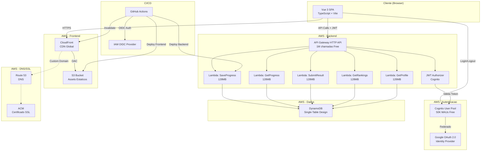
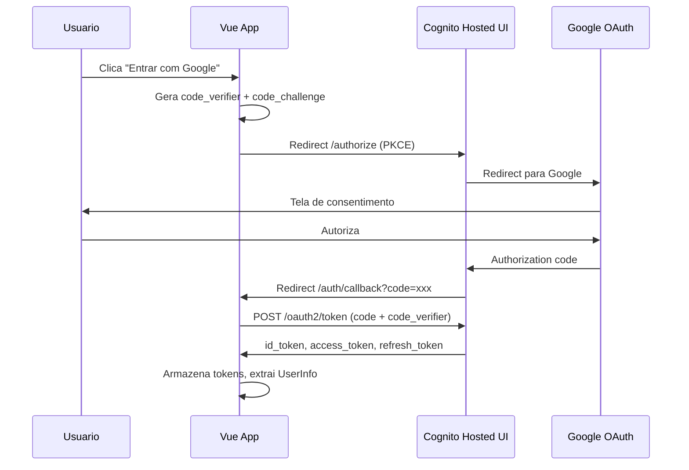
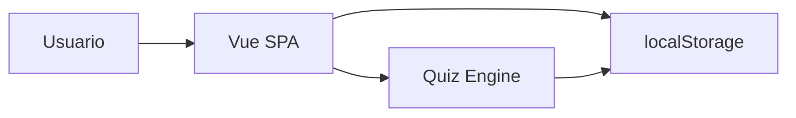
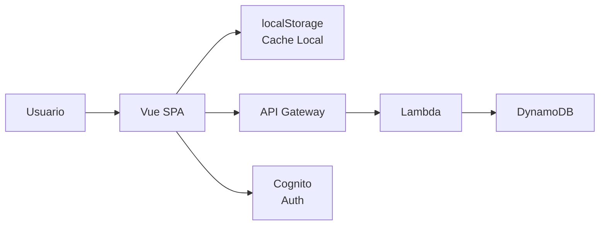
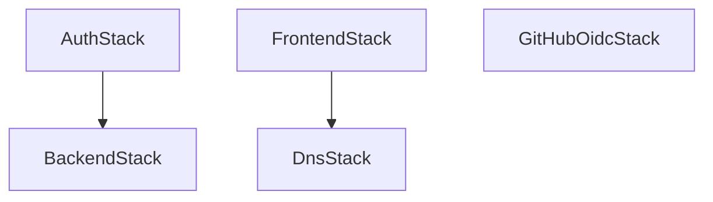

# Arquitetura - Kiro Quest

> Documentacao completa da arquitetura do Kiro Quest na AWS.

---

## Visao Geral

O Kiro Quest e uma aplicacao web SPA (Single Page Application) construida com Vue 3 + TypeScript, hospedada inteiramente na AWS utilizando servicos serverless otimizados para o Free Tier.

### Diagrama de Arquitetura



---

## Componentes

### 1. Frontend (S3 + CloudFront)

| Recurso | Descricao |
|---------|-----------|
| **S3 Bucket** | Armazena os assets estaticos (HTML, JS, CSS, imagens) com acesso privado |
| **CloudFront** | CDN global com Origin Access Control (OAC) para servir conteudo do S3 |
| **CloudFront Function** | Roteamento SPA - redireciona paths sem extensao para `/index.html` |
| **Security Headers** | Content-Type-Options, X-Frame-Options, HSTS, Referrer-Policy, XSS-Protection |

**Configuracao:**
- Bucket: `kiro-quest-site-{AccountId}` (privado, Block All Public Access)
- Price Class: `PRICE_CLASS_100` (regioes mais baratas)
- HTTP/2 + HTTP/3 habilitado
- TLS 1.2+ obrigatorio

### 2. Autenticacao (Amazon Cognito)

| Recurso | Descricao |
|---------|-----------|
| **User Pool** | Gerenciamento de usuarios com email como identificador |
| **Google IdP** | Login federado via Google OAuth 2.0 |
| **App Client** | Configurado para SPA (sem client secret, PKCE flow) |
| **Hosted UI** | Interface de login gerenciada pelo Cognito |

**Fluxo de Autenticacao (PKCE):**



**Tokens:**
- `id_token`: Informacoes do usuario (1h validade)
- `access_token`: Autorizacao para API (1h validade)
- `refresh_token`: Renovacao silenciosa (30 dias validade)

### 3. Backend (Lambda + API Gateway)

| Recurso | Descricao |
|---------|-----------|
| **HTTP API** | API Gateway v2 (mais barato que REST API) |
| **JWT Authorizer** | Valida tokens Cognito antes de executar Lambda |
| **Lambdas** | 5 funcoes Node.js 20, 128MB, timeout 10s |

**Endpoints:**

| Metodo | Path | Lambda | Descricao |
|--------|------|--------|-----------|
| GET | `/api/progress` | GetProgress | Busca progresso do usuario |
| POST | `/api/progress` | SaveProgress | Salva progresso de um estagio |
| POST | `/api/results` | SubmitResult | Registra resultado final |
| GET | `/api/rankings` | GetRankings | Busca ranking de um estagio |
| GET | `/api/profile` | GetProfile | Busca perfil do usuario |

**CORS:** Configurado para aceitar todas as origens (`*`) durante desenvolvimento. Em producao, deve ser restrito ao dominio do frontend.

### 4. Banco de Dados (DynamoDB)

**Design Single-Table** - Uma unica tabela `KiroQuestTable` com design flexivel baseado em partition key (`pk`) e sort key (`sk`).

#### Access Patterns

| Padrao de Acesso | PK | SK | Descricao |
|-----------------|----|----|-----------|
| Progresso por usuario | `USER#{userId}` | `PROGRESS#{stageId}` | Progresso de um estagio |
| Todos os progressos | `USER#{userId}` | `PROGRESS#` (begins_with) | Todos os estagios |
| Resultado por usuario | `USER#{userId}` | `RESULT#{stageId}` | Resultado final |
| Perfil do usuario | `USER#{userId}` | `PROFILE` | Dados do perfil |
| Ranking por estagio | `RANKING#{stageId}` | `SCORE#{score}#{userId}` | Rankings ordenados |

#### GSI1 (Global Secondary Index)

| Padrao de Acesso | GSI1PK | GSI1SK | Descricao |
|-----------------|--------|--------|-----------|
| Rankings globais | `STAGE#{stageId}` | `SCORE#{score}` | Top scores por estagio |
| Atividade recente | `ACTIVITY` | `{timestamp}` | Ultimas atividades |

**Capacidade provisionada:**
- Tabela principal: 5 RCU, 5 WCU
- GSI1: 5 RCU, 5 WCU
- Total: 10 RCU, 10 WCU (dentro dos 25 do Free Tier)

### 5. DNS e SSL (Route 53 + ACM)

| Recurso | Descricao |
|---------|-----------|
| **Route 53** | Hosted Zone para dominio customizado (opcional) |
| **ACM** | Certificado SSL gratuito (us-east-1 para CloudFront) |
| **Alias Record** | A record apontando para CloudFront |

> Nota: Route 53 custa $0.50/mes por hosted zone. Se nao precisar de dominio customizado, pode usar o dominio `*.cloudfront.net` gratuitamente.

### 6. CI/CD (GitHub Actions + OIDC)

| Workflow | Trigger | Descricao |
|----------|---------|-----------|
| `ci.yml` | Pull Request | Build, testes, typecheck |
| `deploy-frontend.yml` | Push main (src/) | Build Vue + S3 sync + CloudFront invalidation |
| `deploy-backend.yml` | Push main (backend/) | Bundle Lambdas + CDK deploy |
| `cdk-diff.yml` | PR (infra/) | CDK diff como comentario no PR |

**Autenticacao:** GitHub OIDC Provider - sem chaves de acesso de longa duracao. A role `KiroQuestGitHubActionsRole` e assumida via `sts:AssumeRoleWithWebIdentity`.

---

## Fluxo de Dados

### Usuario Anonimo (sem autenticacao)



- Progresso salvo em `localStorage` com chave `kiro-quest:progress:v1`
- Funciona offline
- Sem sincronizacao entre dispositivos

### Usuario Autenticado



- Progresso salvo localmente E sincronizado com DynamoDB
- `localStorage` funciona como cache local para performance
- API chamada em background para persistencia
- Se a API falhar, o progresso local e mantido
- Rankings e perfil dependem da API

---

## Modelo de Seguranca

### Principios

1. **Least Privilege** - Cada Lambda tem permissoes minimas necessarias
2. **Zero Trust** - Todas as chamadas a API sao autenticadas via JWT
3. **Defense in Depth** - Multiplas camadas de seguranca
4. **No Secrets in Code** - Variaveis de ambiente e CDK context para configuracao

### Camadas de Seguranca

```
[CloudFront] -- Security Headers + HTTPS obrigatorio
     |
[S3] -- Block All Public Access + OAC
     |
[API Gateway] -- CORS + JWT Authorizer
     |
[Lambda] -- IAM Role minima + VPC (opcional)
     |
[DynamoDB] -- IAM-based access control + Encryption at rest
```

### Autenticacao e Autorizacao

| Camada | Mecanismo |
|--------|-----------|
| Frontend -> Cognito | OAuth 2.0 + PKCE (Authorization Code Grant) |
| Frontend -> API | Bearer token (access_token JWT) |
| API Gateway | JWT Authorizer valida issuer, audience, expiration |
| Lambda -> DynamoDB | IAM Role com permissoes especificas |
| GitHub Actions -> AWS | OIDC Federation (sem chaves estaticas) |

### Headers de Seguranca (CloudFront)

| Header | Valor |
|--------|-------|
| X-Content-Type-Options | nosniff |
| X-Frame-Options | DENY |
| Strict-Transport-Security | max-age=31536000; includeSubdomains; preload |
| Referrer-Policy | strict-origin-when-cross-origin |
| X-XSS-Protection | 1; mode=block |

---

## Infraestrutura como Codigo (CDK)

### Stacks

| Stack | Arquivo | Recursos |
|-------|---------|----------|
| `KiroQuestFrontendStack` | `frontend-stack.ts` | S3, CloudFront, OAC, Security Headers |
| `KiroQuestDnsStack` | `dns-stack.ts` | Route 53, ACM (opcional) |
| `KiroQuestAuthStack` | `auth-stack.ts` | Cognito User Pool, Google IdP, App Client |
| `KiroQuestBackendStack` | `backend-stack.ts` | DynamoDB, Lambdas, API Gateway, JWT Authorizer |
| `KiroQuestGitHubOidcStack` | `github-oidc-stack.ts` | OIDC Provider, IAM Role |

### Dependencias entre Stacks



- `BackendStack` depende de `AuthStack` (precisa do User Pool para JWT Authorizer)
- `DnsStack` depende de `FrontendStack` (precisa da Distribution para Alias record)
- `GitHubOidcStack` e independente

---

## Decisoes de Arquitetura

| Decisao | Justificativa |
|---------|---------------|
| HTTP API vs REST API | HTTP API e ~70% mais barato e suporta JWT authorizer nativo |
| Single-Table DynamoDB | Evita multiplas tabelas, simplifica IAM, otimiza custo |
| CloudFront Function vs Lambda@Edge | CloudFront Functions sao gratuitas (10M invocacoes/mes) |
| PKCE flow vs Implicit | PKCE e mais seguro para SPAs (recomendacao OAuth 2.1) |
| OIDC vs Access Keys | Elimina necessidade de rotacionar secrets no GitHub |
| Provisioned vs On-Demand DynamoDB | Provisioned permite controlar custos dentro do Free Tier |
