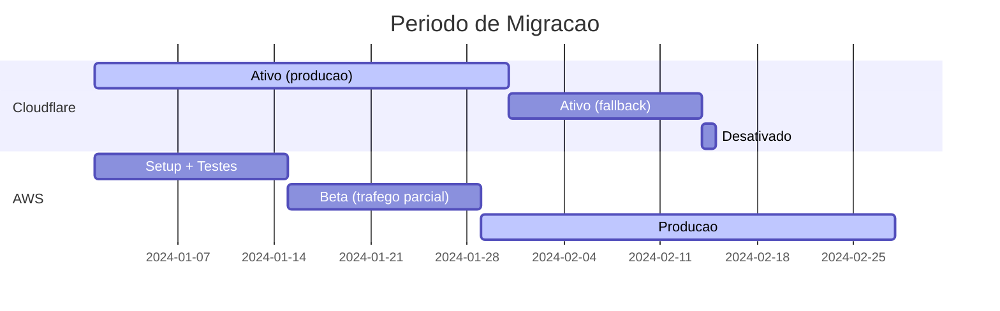

# Guia de Migracao - Cloudflare Workers para AWS

> Guia passo a passo para migrar o Kiro Quest de Cloudflare Workers para AWS.

---

## Visao Geral

A migracao move a hospedagem do frontend de Cloudflare Workers para AWS S3 + CloudFront, e adiciona backend serverless com autenticacao.

### Antes (Cloudflare Workers)

```
[Usuario] --> [Cloudflare CDN] --> [Workers] --> [Assets estaticos]
                                                  (localStorage para progresso)
```

### Depois (AWS)

```
[Usuario] --> [CloudFront CDN] --> [S3 Assets]
          --> [API Gateway] --> [Lambda] --> [DynamoDB]
          --> [Cognito] --> [Google OAuth]
```

---

## Pre-requisitos

### Contas e Acessos

- [ ] Conta AWS criada (Free Tier elegivel)
- [ ] AWS CLI instalado e configurado (`aws configure`)
- [ ] Node.js 20+ instalado
- [ ] Dominio registrado (opcional - pode usar `*.cloudfront.net`)
- [ ] Projeto Google Cloud com OAuth 2.0 configurado (para login com Gmail)

### Google OAuth App

1. Acesse [Google Cloud Console](https://console.cloud.google.com/apis/credentials)
2. Crie um projeto ou selecione existente
3. Em "OAuth consent screen": configure como "External"
4. Em "Credentials" > "Create Credentials" > "OAuth client ID":
   - Application type: Web application
   - Authorized redirect URIs:
     - `https://{seu-cognito-domain}.auth.{regiao}.amazoncognito.com/oauth2/idpresponse`
     - `http://localhost:5173/auth/callback` (desenvolvimento)
5. Anote o **Client ID** e **Client Secret**

---

## Fases da Migracao

### Fase 1 - Infraestrutura Base (Frontend)

**Objetivo:** Hospedar os assets estaticos na AWS mantendo Cloudflare ativo.

```bash
# 1. Instalar dependencias do CDK
cd infra
npm install

# 2. Bootstrap do CDK (primeira vez na conta/regiao)
npx cdk bootstrap aws://{ACCOUNT_ID}/us-east-1

# 3. Deploy do Frontend Stack
npx cdk deploy KiroQuestFrontendStack
```

**Validacao:**
- Acesse a URL do CloudFront exibida no output
- Confirme que a aplicacao carrega corretamente
- Teste a navegacao entre paginas

### Fase 2 - Autenticacao (Cognito)

**Objetivo:** Adicionar login com Google via Cognito.

```bash
# Deploy do Auth Stack com credenciais do Google
npx cdk deploy KiroQuestAuthStack \
  -c googleClientId=YOUR_GOOGLE_CLIENT_ID \
  -c googleClientSecret=YOUR_GOOGLE_CLIENT_SECRET \
  -c cognitoDomainPrefix=kiro-quest
```

**Configuracao do Frontend:**
```bash
# Crie .env.local na raiz do projeto
VITE_COGNITO_USER_POOL_ID=us-east-1_xxxxxxx
VITE_COGNITO_CLIENT_ID=xxxxxxxxxxxxxxxxxxxxxxxxxx
VITE_COGNITO_DOMAIN=https://kiro-quest.auth.us-east-1.amazoncognito.com
VITE_AUTH_REDIRECT_URI=http://localhost:5173/auth/callback
VITE_AUTH_LOGOUT_URI=http://localhost:5173/
```

**Validacao:**
- Execute `npm run dev` localmente
- Clique em "Entrar" e confirme o redirect para Cognito
- Faca login com Google
- Confirme que retorna ao app com usuario autenticado

### Fase 3 - Backend (Lambda + DynamoDB)

**Objetivo:** Persistir progresso na nuvem para usuarios autenticados.

```bash
# Build do backend
cd backend
npm install
npm run build

# Deploy do Backend Stack
cd ../infra
npx cdk deploy KiroQuestBackendStack
```

**Configuracao adicional:**
```bash
# Adicione ao .env.local (ou .env.production para deploy)
VITE_API_URL=https://xxxxxxx.execute-api.us-east-1.amazonaws.com
```

**Validacao:**
- Faca login na aplicacao
- Complete um estagio
- Verifique no DynamoDB que o progresso foi salvo
- Abra em outro navegador, faca login - progresso deve sincronizar

### Fase 4 - CI/CD (GitHub Actions)

**Objetivo:** Deploy automatizado via GitHub Actions com OIDC.

```bash
# Deploy do OIDC Stack
npx cdk deploy KiroQuestGitHubOidcStack \
  -c githubRepo=seu-usuario/kiro-quest
```

**Configuracao no GitHub:**
1. Va em Settings > Secrets and variables > Actions > Variables
2. Adicione:
   - `AWS_ACCOUNT_ID`: Seu Account ID
   - `AWS_REGION`: `us-east-1`
   - `S3_BUCKET_NAME`: Nome do bucket (output do FrontendStack)
   - `CLOUDFRONT_DISTRIBUTION_ID`: ID da distribuicao (output do FrontendStack)
3. Crie um Environment chamado `production`

**Validacao:**
- Faca push para `main`
- Verifique que o workflow executou com sucesso
- Confirme que o site foi atualizado

### Fase 5 - DNS e Dominio Customizado (Opcional)

**Objetivo:** Usar dominio proprio com HTTPS.

```bash
# Deploy do DNS Stack
npx cdk deploy KiroQuestDnsStack \
  -c domainName=kiro-quest.seudominio.com \
  -c hostedZoneName=seudominio.com

# Re-deploy Frontend com dominio
npx cdk deploy KiroQuestFrontendStack \
  -c certificateArn=arn:aws:acm:us-east-1:... \
  -c domainNames=kiro-quest.seudominio.com
```

---

## Periodo de Execucao Paralela

Durante a migracao, ambas as versoes (Cloudflare e AWS) devem funcionar simultaneamente.

### Estrategia



### Checklist de Execucao Paralela

1. **Semana 1-2:** Deploy na AWS, testes internos
2. **Semana 3:** Redirect parcial (10% do trafego via DNS weighted routing)
3. **Semana 4:** Monitorar metricas, resolver problemas
4. **Semana 5:** Aumentar para 50% do trafego
5. **Semana 6:** Cutover completo (100% AWS)
6. **Semana 7-8:** Manter Cloudflare como fallback
7. **Semana 9:** Desativar Cloudflare Workers

### Metricas para Validar

- Tempo de resposta (p50, p95, p99) via CloudWatch
- Taxa de erros 4xx/5xx
- Cache hit ratio no CloudFront
- Funcionalidade de login (monitorar erros no Cognito)
- Persistencia de dados (DynamoDB write successes)

---

## Plano de Cutover DNS

### Opcao A: DNS Weighted (Migracao Gradual)

Se usando Route 53 para ambos:

```
kiro-quest.seudominio.com
  ├── Weighted (90%) --> Cloudflare Workers
  └── Weighted (10%) --> CloudFront
```

Gradualmente aumente o peso da AWS ate 100%.

### Opcao B: DNS Switch (Migracao Rapida)

1. Reduza o TTL do DNS para 60s (pelo menos 24h antes)
2. No momento do cutover, aponte o registro para CloudFront
3. Aguarde propagacao (~5 minutos para TTL baixo)
4. Monitore por 24h
5. Restaure TTL para 3600s

### Atualizacao do Wrangler

Apos a migracao completa, o arquivo `wrangler.jsonc` pode ser removido:

```bash
git rm wrangler.jsonc
```

---

## Plano de Rollback

### Cenario 1: Problemas no Frontend (CloudFront/S3)

**Sintoma:** Site nao carrega, erros 5xx no CloudFront.

**Acao:**
1. Reverta o DNS para Cloudflare Workers (se ja fez cutover)
2. Ou: restaure o ultimo deploy funcional no S3:
   ```bash
   # Re-deploy do ultimo commit funcional
   git checkout <commit-hash>
   npm run build
   cd infra && npm run sync
   ```

### Cenario 2: Problemas no Backend (Lambda/API)

**Sintoma:** API retorna erros, progresso nao salva.

**Acao:**
1. O frontend continua funcional (localStorage como fallback)
2. Verifique logs no CloudWatch
3. Se necessario, faca rollback do CDK:
   ```bash
   cd infra
   npx cdk deploy KiroQuestBackendStack --previous
   ```

### Cenario 3: Problemas no Cognito

**Sintoma:** Login nao funciona, tokens invalidos.

**Acao:**
1. Usuarios podem continuar usando o app sem login (modo anonimo)
2. Verifique a configuracao do App Client no console
3. Confirme os callback URLs

### Cenario 4: Rollback Completo

Se todos os cenarios falharem e for necessario voltar 100% para Cloudflare:

1. Reverta DNS para Cloudflare
2. Faca deploy no Cloudflare Workers:
   ```bash
   npm run build
   npx wrangler deploy
   ```
3. Comunique usuarios que o login esta temporariamente indisponivel
4. Investigue e resolva problemas na AWS antes de tentar novamente

---

## Consideracoes Pos-Migracao

### Itens para Remover

- `wrangler.jsonc` - Configuracao do Cloudflare Workers
- Cloudflare Workers route/cron triggers
- DNS records apontando para Cloudflare (se usando dominio proprio)

### Itens para Atualizar

- URL publica no README (de `*.workers.dev` para novo dominio)
- Links em documentacoes externas
- Configuracao de CORS (restringir origens em producao)
- Google OAuth redirect URIs (adicionar dominio de producao)

### Monitoramento Pos-Migracao

- Configurar CloudWatch Alarms para:
  - 5xx errors > 1% por 5 minutos
  - Lambda duration p99 > 5s
  - DynamoDB throttling events
  - Cognito sign-in failures spike
- Revisar custos semanalmente no primeiro mes
- Validar que todas as funcionalidades operam normalmente
